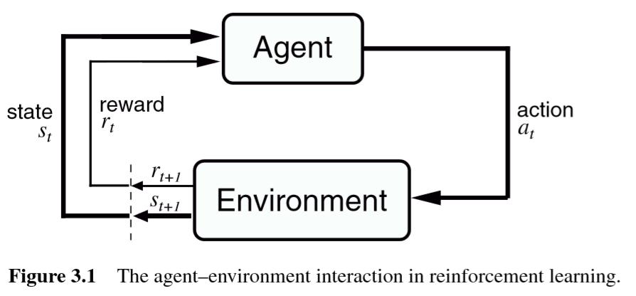
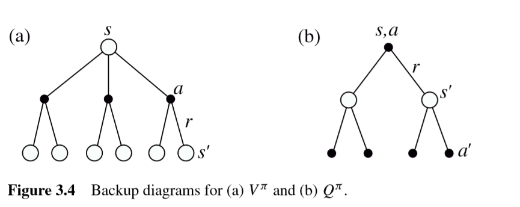
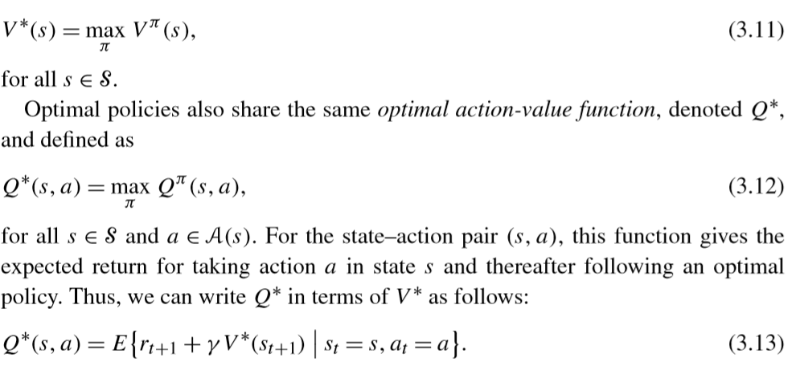
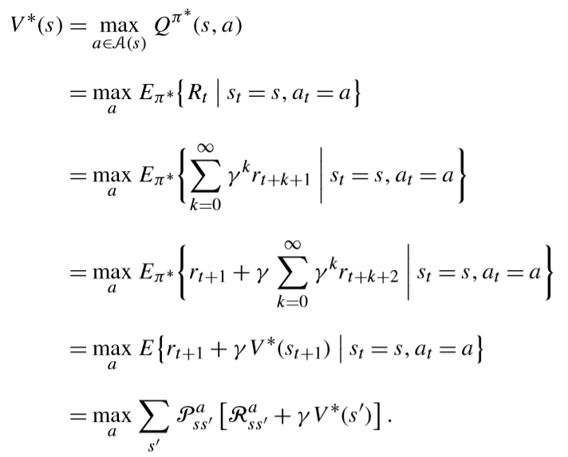
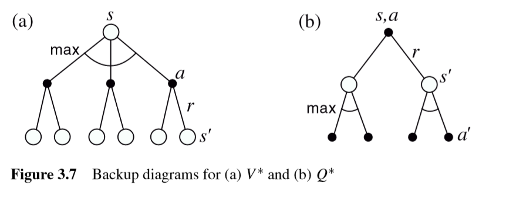

#Reinforcement Learning: An intorduction

## 1. Introduction

The base feature of RL is to learning how to **map** **situations** to **actions**, so to **maximize reward**
actions may affect ont only immediate reward but also next situationa and all subsequent reward

two characteristics: **trial** , **error**

**exploration - exploitation dilemma**

**Component of Reinforcement Learning:**
> - **Policy**
> - **Reward function**
> - **Ralue function**
> - **Model of environment**

$$V(s) ← V(s) + \alpha [V(s') - V(s)]$$

## 2. Evaluative Feedback

RL **evaluate** action token rather **instructs** by giving correct action. Evaluation just feedback  how good the action is, rather whear is best or worst action possible

### 2.1 An n-Armed Bandit Problem

### 2.2 Action-Value Methods

Estimtate $Q^*(a)$, we estimated $Q_t(a)$

$$Q_t(a) = \frac{r_1 + r_2 +r_3 + ... + r_{k_a}}{k_a} $$

$k_a = 0$, default $Q_t(a)$ such as 0,  as $k_a → ∞$ $Q_t(a)$ converge to $Q^*(a)$

#### **$ϵ-greedy$ methods**:
> at probility uniform $ϵ$ select $Q_t(a^*) = \max_a { Q_t(a) }$ 
> else to exploration with random choice 

**Notice** $\epsilon$ should not be to large, reduce $ϵ$ overtime to try get best of both high and low values.

### 2.3 Softmax Action selection

$$ \frac{e^{Q_t(a)/τ}}{∑_{b=1}^n e^{Q_t(a)/τ} }$$

where $τ$ is postive parameter called **temperature**, high $τ$ cause the action to all equiprobable, low $τ$ cause greater difference in selection probability for actions that differ om their value estimates.

one drawback of e-greedy is that it treat each choice as equal. An promption of this problem is softmax action selection, show as before.

### 2.4 Evaluation Versus Instruction

#### Evaluation
> Search(seletion) and evaluate

#### Instruction
> Like supervied learning, you have told the truth, computer gradient

### 2.5 Incremental Implementation

>$$New\ Estimate\ =\ Old\ Estimate\ +\ StepSize\ [Target\ -\ Olde\ Estimate]$$

where $Target$ is desired direction in which to move.

### 2.6 Tracking a Nonsationary Problem

$$\begin{aligned}
Q_k &= Q_{k-1} + α [r_k - Q_{k-1}]\\
&= αr_k + (1-α)Q_{k-1}\\
&= αr_k + (1-α)αr_{k-1} + (1-α)^2Q_{k-2}\\
&= (1-α)^kQ_0 + ∑_{i=1}^k α(1-α)^{k-i}r_i   
\end{aligned}$$

$$\begin{aligned}
    ∑_{k=1}^∞ α_k(a) &= ∞\\
    ∑_{k=1}^∞ α_k^2(a) &< ∞
\end{aligned}$$

### 2.7 Opmtistic Initial Values

Above case we considered is opviewously infulenced by Initial Values $Q_0$ , this mean **biased**.

## 3 The Refinforcement Learning Problem

### 3.1 The Agent-Environment Interface

### 3.2 Goals and Rewards

Maximize the total amount of reward it receives

### 3.3 Returns

$$\begin{aligned}
    R_t  &= r_{t+1} + r_{t+2} + … +r_T\\
\end{aligned}$$

Add **dicount rate** 

$$R_t  = r_{t+1} + γr_{t+2} + ... = ∑_{k=0}^∞γ^kr_{t+k+1}$$

### 3.4 Unified Notation for Episodic and Continuing Tasks

In Episodic task, we not only number steps but also episdodic.

### 3.5 The Markov Property

State should be design for differenet task. Generally, state signal should not be expected to inform agent of everything about the environment, or even everything about that would be useful to it in  making decisions.
we don't fualt an agent for net knowing something taht matters, but only for having kowning and then forgotten it.

$$P(s_{t+1}=s',r_{t+1}=r | s_t, a_t, r_t, s_{t-1}, a_{t-1}, r_{t-1},...) =  P(s_{t+1}=s',r_{t+1}=r | s_t, a_t)$$

which mean only dependent previou situation of few time step.

### 3.6 Markov Decision Processes

$$\mathbb{P}_{ss'}^a = Pr(s_{t+1}=s' | s_t = s, a_t = a)$$
$$\mathbb{R}_{ss'}^a = E(r_{t+1} | s_t = s, a_t = a, s_{t+1} = s')$$

### 3.7 Value Function

Value fucntion estimate **how good** for an agent tobe in given state.

**state-value function for policy $\pi$**

$$V^π(s) = E_π[R_t | s_t = s] = E_π[ ∑_{k=0}^∞ γ^kr_{r+k+1} |s_t = s]$$

**action-value function for ploicy $π$**

$$Q^π(s,a) = E_π[R_t| s_t=s, a_t = a] = E_π[ ∑_{k=0}^∞ γ^kr_{r+k+1} |s_t = s, a_t = a]$$

This also called **Monte Carlo methods**, bucause they involve averaging over random samples of actual returns.

$$\begin{aligned}
    V^π(s) &= E_π[R_t | s_t = s]\\ 
    &= E_π[ ∑_{k=0}^∞ γ^kr_{r+k+1} |s_t = s]\\
    &= E_π[r_{t+1} + ∑_{k=0}^∞ γ^kr_{r+k+2} |s_t = s]\\
    &= ∑_a π(s,a) ∑_s' \mathbb{P}_{ss'}^a [ \mathbb{R}_{ss'}^a + γE_π[ ∑_{k=0}^∞ γ^kr_{r+k+2} |s_{t+1} = s ]\\
    &= ∑_a π(s,a)∑_{s'} \mathbb{P}_{ss'}^a[ \mathbb{R}_{ss'}^a + γV^π(s') ]
\end{aligned}$$

### 3.8 Optimization Value Functions

$$Q^*(s,a) = E\{ r_{t+1} + γ max_{a'} Q^*(s_{t+1},a') | s_t =s, a_t =a \} = ∑_{s'} \mathbb{P_{ss'}^a} [ \mathbb{R_{ss'}^a} + γmax_{a'}Q^*(s',a') ]  $$

### 3.9 Optimality and Approximation

# Elementary Solution Methods

## 4 Dynamic Programming

