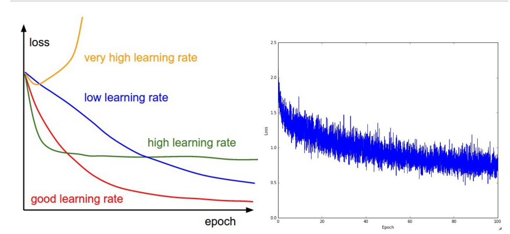

## 激活函数

- sigmoid 有饱和的风险，不能应用在较深的网络中，non-zero-centred
- tanh 相当于对sigmoid的放大，有饱和的风险，并且是zero-centred，这个函数在LSTM中还在使用
- relu 对负值抑制，正侧斜率不变，可以应用在较深的网络中，但是如果落在左侧则有神经元坏死（梯度不再更新）的风险。对learning rate敏感，relu改进为leaky relu（左侧也给予一个较小的梯度）和p relu（对不同的channal给予不同的斜率）但是不能期望它们有太好的结果，实际使用和relu性能差不多
- maxout  一种新提出的激活函数 ${max(a_1*x,a_2*x)}$
- softmax  常用于多分类问题，注意它和logistic不同，softmax预测的类之间应该是不重叠、不存在一类包含另一类的，而logistic则没有这个问题，它对多类预测是独立的。

## fine tuning

- learning rate 

- deepth

- kernel size 
不宜过大，那样会增加计算量，两个3*3的卷积视野相当于一个5\*5的卷积视野，但后者参数更多
- filter/pooling layer 
- batch norm 
${x_i=\frac{x_i-\bar{x}}{\sqrt{\sigma^2+\epsilon}}}$
>
- [Dropout](https://pgaleone.eu/deep-learning/regularization/2017/01/10/anaysis-of-dropout/) 

>依先验概率不使用节点，降低Variance，增加训练时间,Dropout 背后的思想其实就是把DNN当做一个集成模型来训练，之后取所有值的平均值，而不只是训练单个DNN
>
>正如前面所说的，Dropout 以概率 p 来丢弃神经元， 并且让别的神经元以概率 q = 1 - p，进行保留。每一个神经元都有相同的概率被丢弃和保留。 也就是说：给定
> - h(x) = xW + b 是一个线性转换方程，其中输入 x 是一个 di 维度的数据，输出数据是一个 dh 维度的。
>- a(h) 是一个激活函数。
>我们只将 Dropout 作用在模型的训练阶段，即我们可以把模型的激活函数修改为：
>
>$$f(h) = D \odot a(h) $$
>
>
>
>
>
>
>
>- Dropout 方法存在两种形式：直接的和 Inverted。
>- 在单个神经元上面，Dropout 方法可以使用伯努利随机变量。
>- 在一层神经元上面，Dropout 方法可以使用伯努利随机变量。
>- 我们精确的丢弃 np 个神经元是不太可能的，但是在一个拥有 n 个神经元的网络层上面，平均丢弃的神经元就是 np 个。
>- Inverted Dropout 方法可以产生有效学习率。
>- Inverted Dropout 方法应该和别的规范化参数的技术一起使用，从而帮助简化学习率的选择过程。
>- Dropout 方法有助于防止深度神经网路的过拟合。
>
>
>
>
>
>
>

## 评价指标

- Persion/Recall 
${P=\frac{TP}{TP+FP}}$  
${R=\frac{TP}{TP+FN}}$
- F-score  
${F1=\frac{2PR}{P+R}}$
- ROC/AUC 
- mAP 一般用在视觉/图像方面

