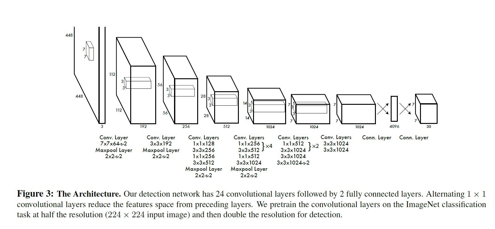

<h1>关于面试的一些建议</h1>

>

# Tell a Story

>在介绍自己和自己的项目的时候一定要有条理，突出重点。重点表现你做过什么，有什么效果。

## 关于我的物体检测项目

一般来说，一个机器学习项目应该分为：数据预处理、特征工程、模型选择、模型评估、迭代调参

### 数据预处理

>**数据来源**：对于我做的Yolo的物体检测的复现，使用了VOC2007(2012)作为数据集
>
>**数据增强**：对图片加噪,灰度，二值化，扭曲，抖动，旋转

>**数据不平衡**：上采用和下采样，对深度学习而言下采样并不是直接随机丢弃一部分图像，因为那样做会降低训练数据多样性进而影响模型泛化能力。正确的下采样方式为，在批处理训练时对每批随机抽取的图像严格控制其样本较多类别的图像数量。
>
>类别重组法只需原始图像列表即可完成同样的均匀采样任务。其方法步骤如下：首先按照类别顺序对原始样本进行排序，之后计算每个类别的样本数目，并记录样本最多的那个类别的样本数量。之后，根据这个最多样本数对每类样本产生一个随机排列列表，然后用此列表中的随机数对各自类别的样本数求余，得到对应的索引值。接着，根据索引从该类的图像中提取图像，生成该类的图像随机列表。之后，把所有类别的随机列表连在一起随机打乱次序，即可得到最终图像列表，可以发现最终列表中每类样本数目均等。根据此列表训练模型，当训练时列表遍历完毕，则重头再做一遍上述操作即可进行第二轮训练，如此重复下去⋯⋯类别重组法的优点在于，只需原始图像列表，且所有操作均在内存中在线完成

### 神经网络模型

>**初始化**：Xaiver、He initialization
>
>**激化函数**：Sigmoid、tanh、relu、leaky relu、P relu、Maxout、softmax
>
>**优化器**：SGD、Momentum、Adadelta、Adagid、RMSProp、Adam
>
>**卷积、池化**
>
>**损失函数**：
>$$L=\lambda_{cord}\sum_{i=0}^{s^2}\sum_{j=0}^{B} \mathbb1_{ij}^{obj}[(x_i-\hat x_i)+(y_i-\hat y_i)]+\lambda_{cord} \sum_{i=0}^{s^2}\sum_{j=0}^{B} \mathbb1_{ij}^{obj}[(\sqrt w_i -\sqrt{\hat w_i})^2+(\sqrt h_i -\sqrt{\hat h_i})^2]+\sum_{i=0}^{s^2}\sum_{j=0}^{B} \mathbb1_{ij}^{obj}(c_i-\hat c_i)^2+\lambda_{noobj}\sum_{i=0}^{s^2}\sum_{j=0}^{B} \mathbb1_{ij}^{noobj}(c_i-\hat c_i)^2+\sum_{i=0}^{s^2}\mathbb 1_i^{obj}\sum_{c\in classes}(p_i(c)-\hat p_i(c))^2$$
>
>**残差网络**
>
>**正则化**：BatchNorm、Dropout、Data Augmentation、L0、L1、L2

>**Anchor box**
>
>**Architecture**
>

### 调参

>**数据处理相关参数**
>enrich data
>feature normalization and scaling
>batch normalization
>Dropout
>**训练过程中的参数**
>momentum term（训练动量）,BGD, SGD, mini batch gradient descent(http://blog.csdn.net/qq_20259459/article/details/53943413 ）。
>number of epoch,
>learning rate
>objective function
>weight initialization
>regularization
>**网络相关参数**
>number of layers
>number of nodes
>number of filters
>classifier(分类器的选择)

