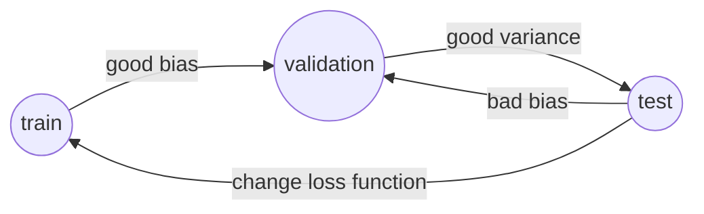

<h1>阿里CBU 算法工程师实习</h1>
<!-- TOC -->

- [1. 一面](#1-%E4%B8%80%E9%9D%A2)
    - [1.1. Questions](#11-questions)
    - [1.2. Comment](#12-comment)
- [2. 二面](#2-%E4%BA%8C%E9%9D%A2)
    - [2.1. Questions](#21-questions)
    - [2.2. Comment](#22-comment)

<!-- /TOC -->
 
# 1. 一面 

- time 2018/3/8
- department CBU
- job 算法（机器学习）
 
## 1.1. Questions
 - 项目细节

>这里我主要说了自己做的Yolo的复现，主要包括：预处理、网络结构（卷积赤、池化参数），优化器，损失函数（IOU、confidence），说了一下为什么损失函数中对$P^{nobj}$和$P^{obj}$加权，如何降低对背景的误判（提升召回率），并且说了一下Yolo和R—CNN、Fast RCNN、Faster RCNN 的不同点

 - 如何调参

>这里主要说了对**train set** 、**validation set**、 **test set**的评价和**bias**、**var**的关系。

>如果模型对于**train set**评价好，而对**validation set**评价低则**bias较大**，于是用更深的网络、卷积核|池化（这个一般用比较小的数）、改变优化器、更多的数据（可以尝试用数据增强）、激活函数、增加迭代次数、参数初始化（Xaiver和He initialization）

>如果模型对于**train set**和**validation set**评价好，而对test set评价低则**var较大**，这时候要降低过拟合，方法有：**正则化项**、**early stop**、**增加数据**、**卷积和池化**也能微弱降低过拟合、**Batch Norm**、**Drop out**（这个会影响loss的观察，因此推荐最后使用）

 - 如何选择激活函数

>这里主要说了一下常见的激活函数的特性，Sigmoid、Tanh、ReLU、Leaky ReLU、PReLU，具体可以查看[我的深度学习笔记](../deeplearning/note.md)

 - 如何评价模型

ROC/AUC、Persion、Recall、F-score

 - 动态规划
 
 
## 1.2. Comment
 面试官很nice，部门主要做的是搜索和推荐系统

# 2. 二面 
-  time 2018/3/15
-  department CBU
-  job 算法（机器学习）
 
## 2.1. Questions
 - 项目细节
 - 说一个你熟悉的机器学习算法

>这里我说了SVM，原本对理论推导很熟悉，然而面试的时候少说了很多东西😭。

SVM的推导主要包括：函数/几何间隔、间隔最大化（这里应该穿插着对线性可分的数据求的最大间隔的存在性和唯一性证明）、拉格朗日乘数法、对偶算法、软间隔、核函数（可以顺便解释什么是正定核和正定核充要条件的证明，还有常用的核函数：多项式、高斯核、字符串核）、合页损失函数、正则化

 - 编程题
 >有2枚硬币，随机选择一枚投掷100次作为一个样本，共有10000给样本，分类问题

这里当时没有想好，我觉得K-means可以做，要求给出代码实现
 
 - 一天时针和分针重合多少次

 如果算上0点和24点，结果是22次。时针角速度为${ \frac{30\degree}{60 min} }$，分针角速度为 ${ \frac{360\degree}{60 min} }$，它们相对速度为${ 5.5\degree/min }$，每$360\degree$重合一次，结果为$\frac{24 * 60 * 5.5}{360} = 22$
 
## 2.2. Comment
 后面两个问题都没回答正确，最后问评价,面试官也是很客气了，感觉是挂了 ε(┬┬﹏┬┬)3

