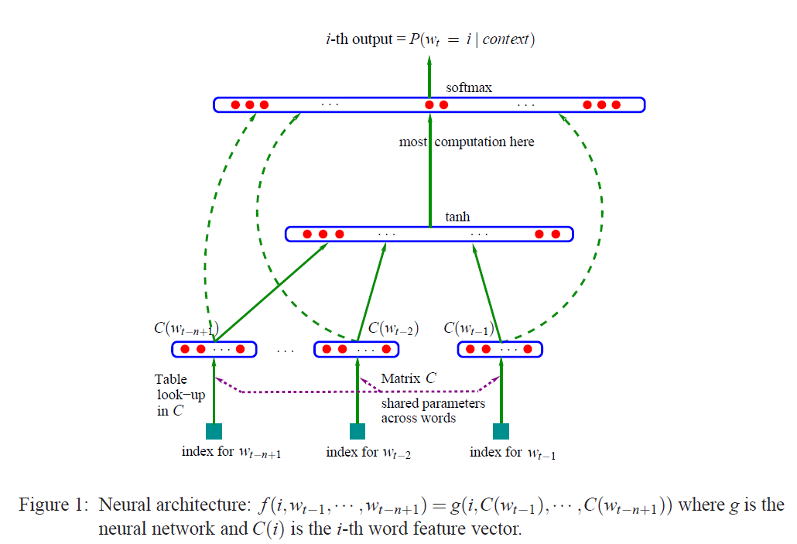
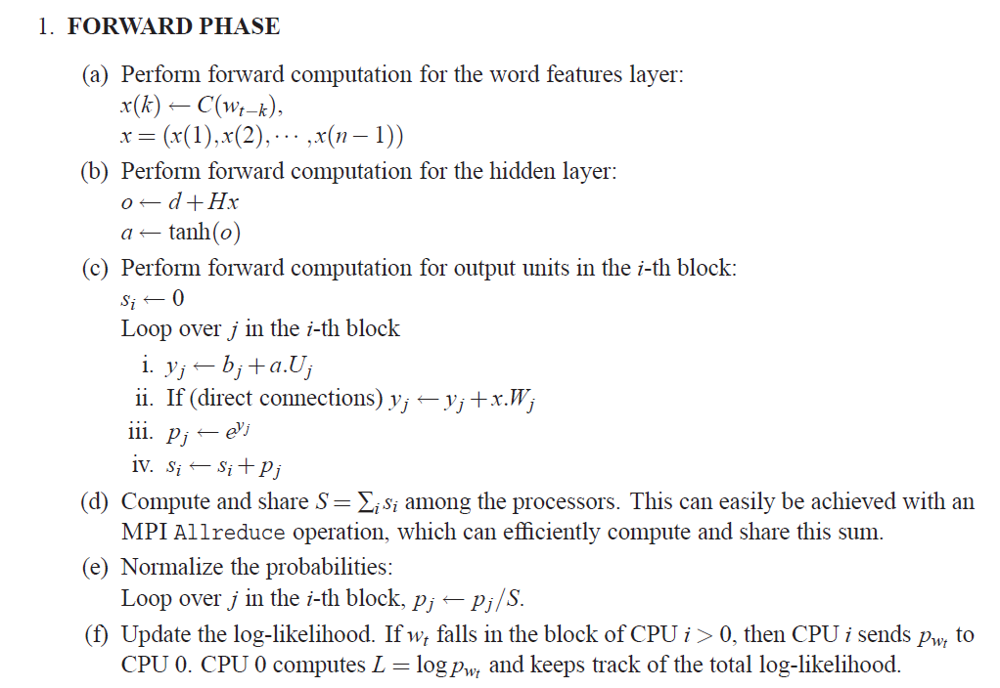

<h1>A Neural Probabilistic Language Model</h1>

# The Mean Idea

>This paper give a way to deal with the **curse of dimensionality**, that make a **Mapping Matrix $C$** ,which is $|V| \times m$. Here $m$ is dimension of feature vector.

>In this paper, rather common way to compute the probility of time series probility with all $n$ element, here we just take latest $n$ element into consideration, which called **n-gram**, so we get this equation:
>
$$\begin{aligned}
P(w_1^T) &= \prod_{t=0}^T P(w_t|w_1^{t-1}) \\
\\
P(w_t | w_1^{t-1}) &\approx P(w_t|w_{t-n+1}^{t-1})
\end{aligned}$$

The neural architecture show as fig:

>Here we use **Maximizes log-likelihood**, and take nagetive of this as loss function:

$$L = \frac1T \sum_t{\log{f(w_t,w_{t-1},w_{t-2,...,w_{t-n+1}};\theta)}} + R(\theta)$$

>And use **softmax** at ouput layer

$$ P(w_t|w_{t-1},...,w_{t-n+1}) = \frac{e^{y_{w_t}}}{\sum_i{e^{y_i}}} $$

$$ y = b + Wx + U \tanh(d + Hx) $$

> where $x$ is Concat of latest $n-1$ elements,its shape is $|V| \times (n-1)m$

$$ x= ( C(w_{t-1}), C(w_{t-2}), ... , C(w_{t-n+1}) )$$

**Notations**:

| Notation | Mean | Shape | 
| - | :-: | -: | 
| $b$ | output bias | $V$ | 
| $W$ | optionally zero (no direct connections) | $V \times (n-1)m$ | 
| $U$ | hidden-to-output weights | $V \times h$ | 
| $d$ | hidden bias | $h$ | 
| $H$ | hidden layer weights | $h \times (n-1)m$ | 

>use **SGD** neural net update rule:

$$ \theta \gets \theta + \epsilon \frac{\partial L}{\partial \theta} $$ 

the **foward & backprop** detail show as next figs:

# The Result

