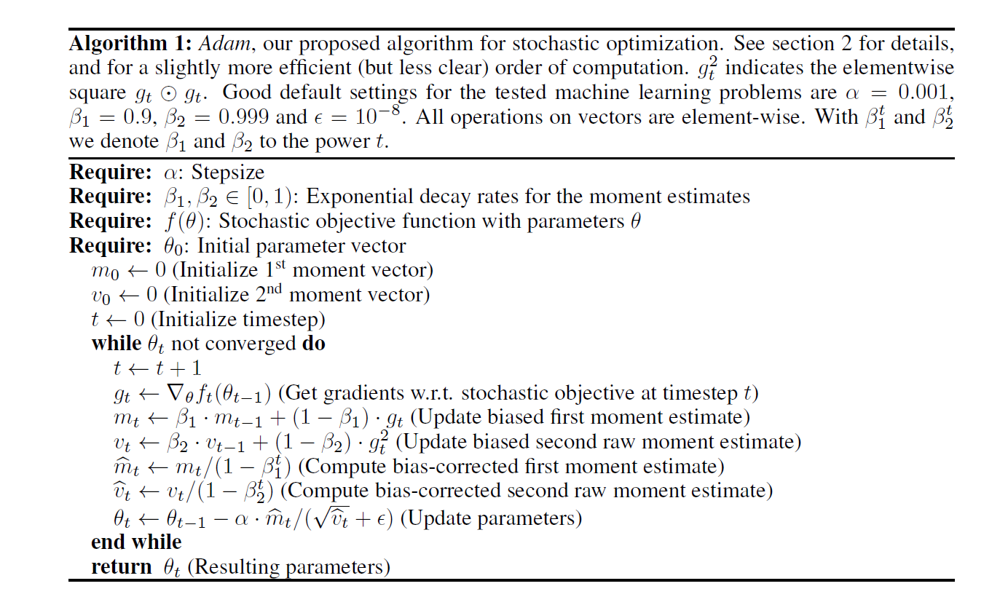

# ADAM: A METHOD FOR STOCHASTIC OPTIMIZATION

## The Algorithm
>This paper proposal a optimal rele called **Adam**, the detail of algorithm show as fig:

## The Feature

>The common way of learning algorithm, the target is **minimizing expectecd value of loss function**

Adam careful choice stepsize $\alpha$

$$\Delta_t =\alpha\cdot\frac{\hat m_t}{\sqrt{\hat v_t}}$$
The stepsize has **two upper bounds**:

$$ |\Delta_t| \le \alpha \cdot \frac{(1-\beta_1)}{\sqrt{1-\beta_2}}  $$

