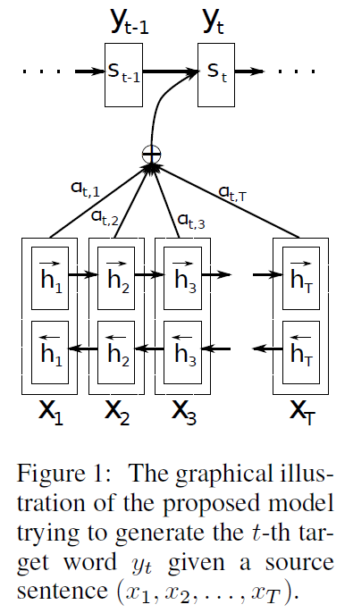
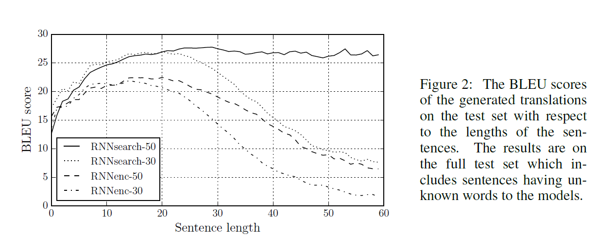

# Attention Model
> Neural Machine Translation by Jointly Learning to Align and Translate

>Paper link: [Neural Machine Translation by Jointly Learning to Align and Translate](https://arxiv.org/abs/1409.0473)

## The Probelm

### encoder-decoder's issue

>Let neural netword **comporess** all necessary information  of souce sentence into a **fixed-length vector** could be difficult.

### Solution

> Let model learns to align and translate jointly
>
>Basic encoder-decoder does **not** encode whole input sentence, rather to choose a **subset**. 
>

## Background

### About Translation

> From the view of **probability**, Translation task is to find a target sentence $\bm Y$ given input sentence $\bm X$ with maximized condition probability $\arg \max_{Y} P(Y|X)$

### RNN encoder-decoder

#### framework

>$$\begin{aligned}
h_t &= f(x_t,h_{t-1}) \\
c &= q({h_1,...h_{T_x}})\\
\end{aligned}$$
>
>where $h_t$ is hidden state at time $t$, $c$ is vector generated from sequence of the hidden states.
>
>$$P(y) = \prod_{t=1}^T P(y_t |y_1,...y_{t-1},c) $$
$$ y = (y_1,...,y_{T_y}) $$
$$P(y_t |y_1,...y_{t-1},c) = g(y_{t-1},s_t,c)$$

### Learning to align and translate

#### Decoder

>$$\begin{aligned}
P(y_t |y_1,...y_{t-1},c) &= g(y_{t-1},s_t,c) \\ 
s_i &= f(s_{i-1},y_{i-1},c_) \\ 
c_i &= \sum_{j=1}^{T_x} \alpha_{ij}h_j\\
\alpha_{ij} &= \frac{\exp(e_{ij})}{\sum_{k=1}{T_x}{\exp(e_{ik})}} \\ 
e_{ij} &= \alpha(s_{i-1},h_j)
\end{aligned}$$
>
>here the probability is **conditioned** on a distinct context vector $c_i$ for each target word $y_i$

#### Encoder
>This part take **BiRNN**

## Experiment

