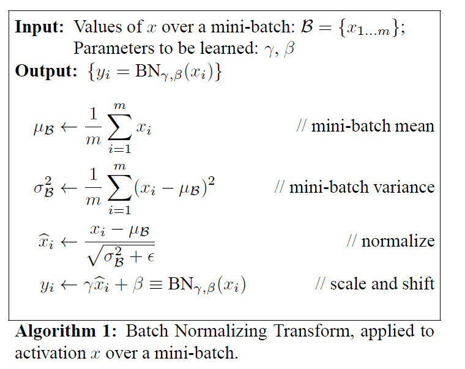
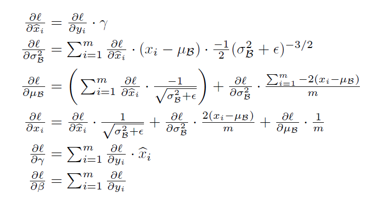
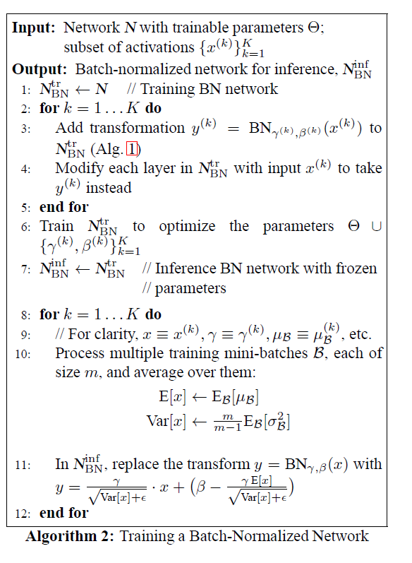

# Batch Normalization:Accelerating Deep Network Training by Reducing Internal Covariate Shift

>**Paper Link**
>[Batch Normalization:Accelerating Deep Network Training by Reducing Internal Covariate Shift](https://arxiv.org/abs/1502.03167)

## 1. Introduction

>This part give a view on general gradient descent update rule:
$$\begin{aligned}
\Theta &= \arg \min_\Theta \frac1N \sum_{i=1}^N l (x_i,\Theta)  \\
\end{aligned}$$
$$\frac1m \frac{\partial l(x_i,\Theta)}{\partial \Theta}$$

> Consider two layer condition
$$l = F_2(F_1(u,\Theta_1),\Theta_2)$$
$$ x = F_1(u,\Theta_1)$$
$$l = F_2(x,\Theta_2)$$
$$\Theta_2 \gets \Theta_2 -\frac{\alpha}{m}\sum_{i=1}^m \frac{\partial F_2(x_i,\Theta_2)}{\partial \Theta_2}$$

> This paper also talk about **gradient vanish** problem is sigmoid/tanh activate function, this could be solved by replace activate fucntion with **ReLU** and careful **initialization** (even author never notice, but **He initialization** should work well)
>
>**BN** reduce dependence of gradients on the **scale** of the parameters or of their **initial** values.
>
>Batch Normalization makes it possible to use **saturating nonlinearities** by preventing the network from getting stuck in the saturated modes

# 2.Towards Reducing Internal Covariate Shift

# 3. Normalization via Mini-Batch Statistics

## 3.1 Training and Inference with Batch-Normalized Networks

## 3.2 Batch-Normalized Convolutional Networks

## 3.3 Batch Normalization enables higher learning rates

## 3.4 Batch Normalization regularizes the model

