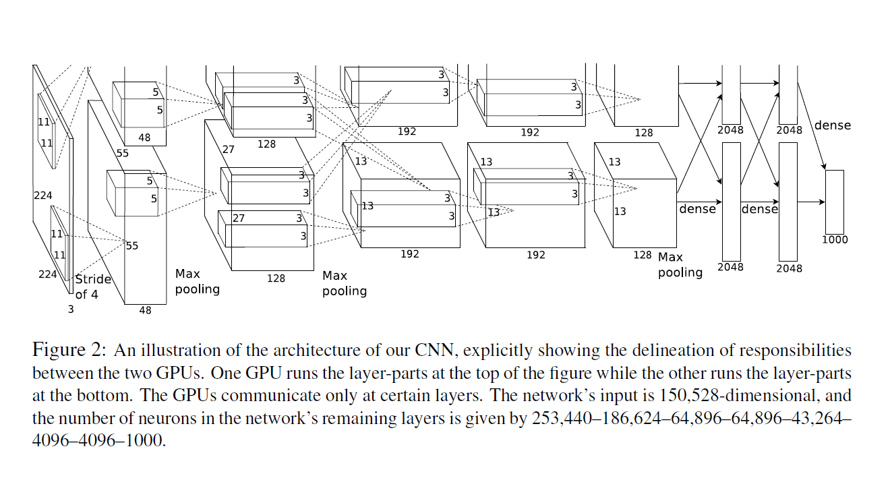
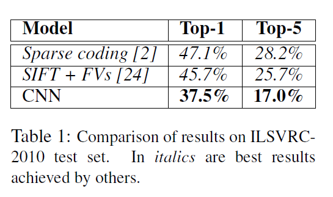
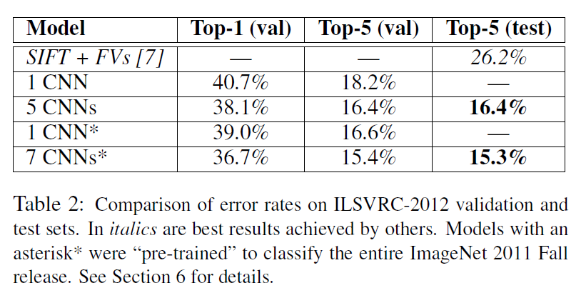

# Note on AlexNet

>Paper Link: [ImageNet Classification with Deep Convolutional
Neural Networks](http://papers.nips.cc/paper/4824-imagenet-classification-with-deep-convolutional-neural-networks)

**Generation**

This paper introduce a neural net work to classify image with tricks.

## Neural Net Architecture

## Reducing Overfitting

### Date Augmentation

> 2 ways:
>
> - generating image translations and horizontal reflections
> - altering the intensities of the RGB channels in training images

### Dropout

## Details of learning

> **Update Rule**
>
>$$\begin{aligned}
v_{i=1} &:= 0.9 \cdot v_i - 0.0005 \epsilon \cdot w_i - \epsilon \cdot (\frac{\partial L}{\partial w}|w_i)_{D_i} \\
w_{i+1} &:= w_i + v{i+1}
\end{aligned}$$
>
>**Initialize**
>
>initialized the **weights** in each layer from zero-mean Gaussian distribution with standard deviation 0.01, initialized the neuron **biases** in the remaining layers with the constant 0

## Result

>Network achieves top-1 and top-5 test set error rates of 37.5% and 17.0%
