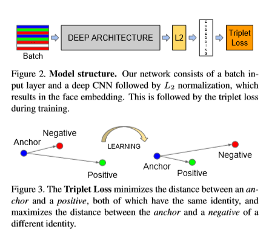

#FaceNet: AUnifiedEmbeddingforFaceRecognitionandClustering

>The main contribution of this paper is** triplet loss**

# Abstraction

> present facenet directly learns a mapping from face image to a compact Euclidean space where distance directly correspond to a measure of face similarity.
> 
> method uses a deep convolutional network trained to directly optimize the embedding itself, rather than an intermediate bottleneck layer as in previous deep learning approaches.

# 1 Introduction

>Once embedding space has been produced, aforementioned tasks become straight-forward: 
>- face verification simply involves **thresholding** the distance between the two embeded vectors
>- recognition becomes a k-NN classification problem
>- clustering can be achieved using off-the-shelf techniques such as k-means or agglomerative clustering

>previous way of face recognition based on deep networks use classifcation layers, trained over a set of known face identities and then take an intermediate bottleneck layer as a representation used to generalize recognition beyound the set of identities used intraing.
>However this is indirectness and ineffciency:
>one has to hope that the bottleneck representation generalizes well to new faces
>using a bottleneck layer the representation size per face is usually very large, some one use PCA, but this is linear transformation that can be easily learnt in one layer of network

>Choosing which **triplets** to use turns out to be very important for achieving good performance

## 2 Related work

This part introduce few work before, which we don't intereseted

## 3 Method

### 3.1 Triplet loss

$$||x_i^a - x_i^p|| + α < ||x_i^a - x_i^n||_2^2,\ ∀ (x_i^a, x_i^p, x_i^n) \in \mathcal{T}$$

where $α$ is margin,
then we try to minimize loss:
$$L = ∑_i^N [|| f(x_i^a) - f(x_i^p) ||_2^2 - ||f(x_i^a) - f(x_i^n)||_2^2 + α]$$

>These triplets would not contribute to the training and result in slower convergence, as they would still be passed through the network. It is crucial to select hard triplets, that are active and can therefore contribute to improving the model. 

### 3.2 Triplet selection

> In order to ** fast convergence**, we want to select an $x_i^p$ to $\arg \max_{x_i^p} ||f(x_i^a) - f(x_i^p)||_2^2 $
> $x_i^n$ to $\arg \max_{x_i^n} ||f(x_i^a) - f(x_i^n)||_2^2 $
> It is **infeasible** to compute the argmin and argmax across the whole training set. Additionally, it might lead to poor training, as mislabelled and poorly imaged faces would dominate the hard positives and negatives. There are two obvious choices that avoid this issue: 
> - Generate triplets offline every n steps, using the most recent network checkpoint and computing the argmin and argmax on a subset of the data.
> - Generate triplets online. This can be done by selecting the hard positive/negative exemplars from within a mini-batch

> ensure a minimal number of exemplars of any one identity is present is in each mini-batch
> randomly sampled negative faces are added to each mini-batch
> Instead of picking the hardest positive, we use all anchor positive pairs in a mini-batch while still selecting the hard negatives.
> Selecting the hardest negatives can in practicelead to bad local minima early on in training, specifically it can result in a collapsed model，In order to mitigate thi, it helps to select $x_i^n$, such that $$|| f(x_i^a) - f(x_i^p) ||_2^2 < ||f(x_i^a) - f(x_i^n)||$$