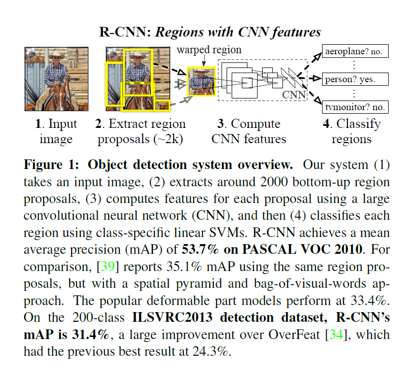

# Rich feature hierarchies for accurate object detection and semantic segmentation Tech report (v5)

- [Paper link](https://arxiv.org/abs/1311.2524)
- [Code](https://github.com/rbgirshick/rcnn)

# Abstract 

- One CNN for **Region proposals**
- Anthor for **classfication**

