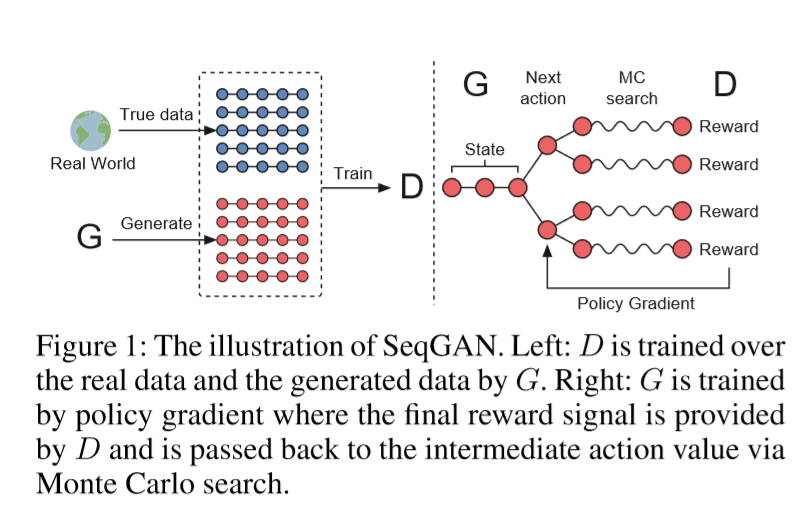
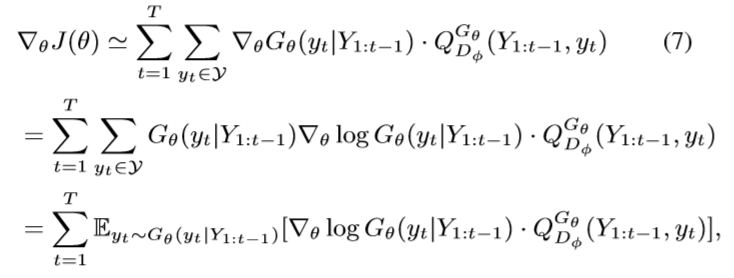
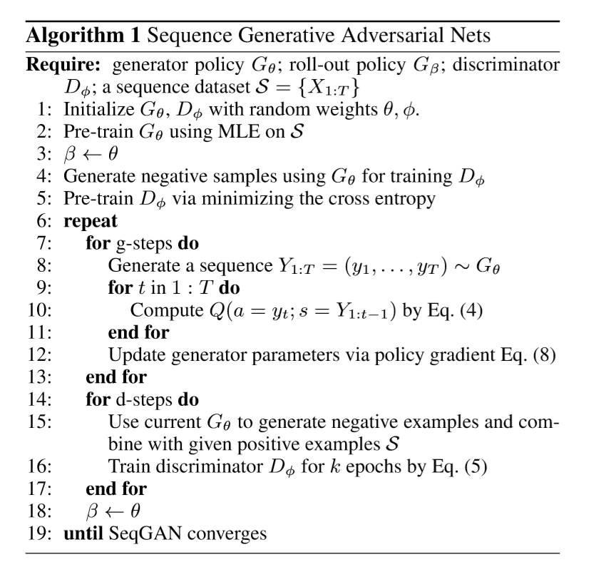

#SeqGAN: Sequence Generative Adversarial Nets with Policy Gradient

This paper talk about GAN has some draw point like: can't generate **discrete** data, and there **gap** between inference and training.

Maximizing training data likelihood suffers from difficulty of approximating intractable probabilistic computations.

so author of this paper introduce **Reinforcement Learning**

## Denote and Equation

we define $G_θ(y_t|Y_{1:t-1})$ as policy model 

$$\begin{aligned}
    J(θ) &= \mathbb{E}[ R_T | s_0,θ ] = ∑_{y_1 \in \mathcal{Y} } G_θ (y_1|s_0) ⋅ Q_{D_\phi}^{G_θ} (s_0, y_1) \\
    Q_{D_\phi}^{G_θ}(a=y_T , s &= Y_{1:T-1}) = D_\phi (Y_{1:T})
\end{aligned}$$

However, discriminator only provides a reward value for a finished seqence. so we apply Monte Carlo search with a roll-out policy $G_β$ to sample the unknown last $T-t$ tokens.

$${\{ Y_{1:T}^1 , ... , Y_{1:T}^N\}} = MC^{G_β}(Y_{1:t};N) $$

action-value function:

$$Q_{D_\phi}^{G_θ}(s=Y_{1:t-1} , a=yt) = \begin{cases}
    \frac{1}{N} ∑_{n=1}^N D_ϕ(Y_{1:T}^n), Y_{1:T}^n ∈ MC^{G_β}(Y_{1:t};N), \ if t<T \\
    D_\phi(Y_{1:t})
\end{cases} $$

Once we have a set of more realistic generated sequences, we shall re-train the discriminator model as follows:

$$\min_\phi -\mathbb{E}_{Y \sim p_{data}} [ logD_\phi(Y) ] - \mathbb{E}_{Y\sim G_θ} [log(1-D_\phi(Y))]$$

$$\triangledown_θ = ∑_{t=1}^T  \mathbb{E}_{Y_{1:t-1} ∼G_θ} [ ∑_{y_t \in \mathcal{Y} } \triangledown_θ G_θ(y_t|Y_{1:t-1})⋅ Q_{D_\phi}^{G_\theta}(Y_{1:t-1},y_t)  ] $$

