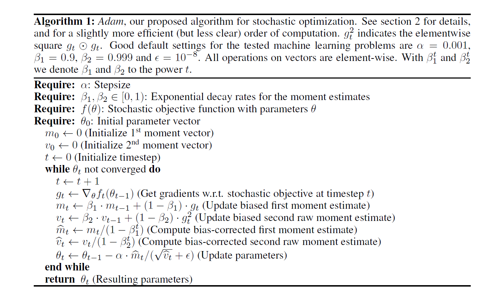

# ADAM: A METHOD FOR STOCHASTIC OPTIMIZATION

## The Algorithm
>This paper proposal a optimal algorithm called **Adam**, the detail of algorithm show as fig:

## The Feature

>The common way of learning algorithm, the target is **minimizing expectecd value of loss function**

Adam careful choice stepsize $\alpha$

$$\Delta_t =\alpha\cdot\frac{\hat m_t}{\sqrt{\hat v_t}}$$

$$ |\Delta_t| \le \alpha \cdot \frac{(1-\beta_1)}{\sqrt{1-\beta_2}}  $$

The stepsize has **two upper bounds**:

$$\begin{cases}
|\Delta_t| \le \alpha \cdot \frac{(1-\beta_1)}{\sqrt{1-\beta_2}} &\qquad, (1-\beta_1)>\sqrt{1-beta_2}  \\
|\Delta_t|<\alpha &\qquad, otherwise
\end{cases}$$

>the first case only happens in servere case of sparsity: gradients has been zero at all timesteps except current timestep. For less sparse cases, the effective stepsize will be smaller. 
>
>When $1-\beta_1 = \sqrt{1-\beta_2}$, We have $\frac{\hat m_t}{\sqrt{\hat v_t}} < 1$. 
>
>In more common scenarios, we will have $\hat m_t / \sqrt{\hat v_t} \approx \pm1$, since $|\mathbb E[g] / \sqrt{ \mathbb E[g^2] } \le 1$.
>
>The effective magnitude of steps taken in parameter space at each timestep are approximately bounded by the stepsize setting $\alpha$
>
>This can be understood as establishing a **trust region** around the current parameter value, beyond which the current gradient estimate does not provide sufficient information. This typically makes it relatively easy to know the right scale of $\alpha$ in advance. For many machine learning models, for instance, we often know in advance that good optima are with high probability within some set region in parameter space; it is not uncommon, for example, to have a **prior** distribution over the parameters. Since $\alpha$ sets (an upper bound of) the magnitude of steps in parameter space, we can often deduce the right order of magnitude of $\alpha$ such that optima can be reached from $\theta_0$ within some number of iterations. With a slight abuse of terminology, we will call the ratio $\hat m_t / \sqrt{\hat v_t}$ the signal-to-noise ratio (SNR). With a smaller SNR the effective stepsize $\Delta_t$ will be closer to zero. This is a desirable property, **since a smaller SNR means that there is greater uncertainty about whether the direction of bmt corresponds to the direction of the true gradient**.

## Bias correction

$$\begin{aligned}
v_0&=0\\
v_t&=\beta_2 \cdot v_{t-1} + (1-\beta_2) \cdot g_t^2\\
v_t&=(1-beta_2) \sum_{i=1}^t \beta_2^{t-i}\cdot g_i^2
\end{aligned}$$

we wish to get expected value of the exponential moving average at timestep t:

$$\begin{aligned}
\mathbb E[v_t] &= \mathbb E[(1-beta_2) \sum_{i=1}^t beta_2^{t-i} \cdot g_i^2] \\
&=\mathbb E[g_t^2] \cdot (1-beta_2) \sum_{i=1}^2 \beta_2^{t-i} + \zeta \\
&= \mathbb E[g_t^2] \cdot (1-\beta_2^t) + \zeta
\end{aligned}$$

Where $\zeta = 0$ is $\mathbb E[g_i^2]$ is stationary, otherwise $\zeta$ will keep small.

## Convergence Analysis

We define Regret as
 
$R(T) = \sum_{t=1}^T [f_t(\theta_t) -f_t(\theta^*)] \qquad \theta^* = \arg\max_{\theta \in \mathcal X } \sum_{t=1}^T f_t(\theta)$