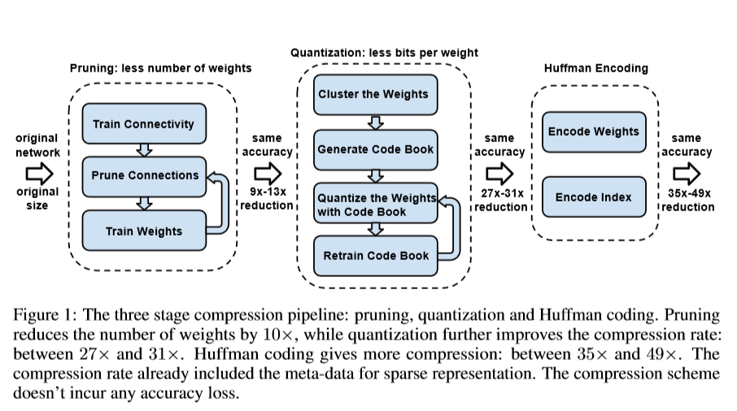
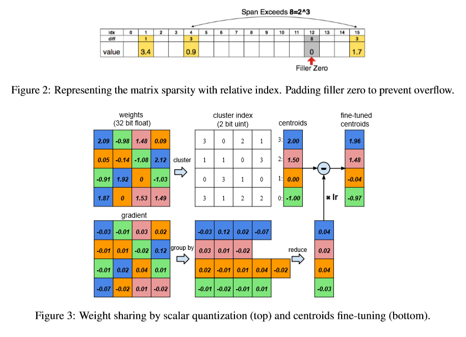

# DEEP COMPRESSION: COMPRESSING DEEP NEURAL NETWORKS WITH PRUNING, TRAINED QUANTIZATION AND HUFFMAN CODING

>This paper introduced 3 pipeline to compressino model ,reduce model size and accelerate model
- pruning
- trained quantization
- Huffman coding

## 1 Introduction

 >First,we prune the networking by **removing there dundant connections**,keeping only the most informative connections. Next, the weights are quantized so that multiple connections share the same weight, thus only the codebook (effective weights) and the indices need to be stored. Finally, we apply Huffman coding to take advantage of the biased distribution of effective weights. 

 >Our main insight is that, **pruning** and **trained quantization **are able to compress the network without interfering each other, thus lead to surprisingly high compression rate. 

## 2 Network pruning

## 3 Trained Quantization and weight sharing

> We limit the number of effective weights we need to store by having multiple connections share the same weight, and then fine-tune those shared weights

### 3.1 Weight sharing

>We use k-means clustering to identify the shared weights for each layer of a trained network, so that all the weights that fall into the same cluster will share the same weigth. **weigths are not share across layers.**

$$\arg \min_C \sum_{i=1}^k \sum{w\in c_i}|w-c_i|^2$$

### 3.2 initisalization fo shared weigths

>Centroid intialization impacts the quality of clustering
> three initialization methods: Forgy(random), density-based, and linear initialization
>**Larger weights** play a more important role than smaller weights, but there are **fewer** of these large weights. Thus Forge initialization and density-based initialization, very few centroids have large absolute value which resoult poor representation of these few larger weights.** Linear initialization does not suffer from this problem**.

### 3.3 Feed-forward and Back propogation

$$\frac{∂\mathcal{L}}{∂C_k} = ∑_{i,j}\frac{∂\mathcal{L}}{∂W_{ij}} = ∑_{i,j}\frac{∂\mathcal{L}}{∂W_{ij}}\mathbb{1}(I_{ij}=k)$$

## 4 Huffman coding

 >It uses variable-length codewords to encode source symbols. The table is derived from the occurrence probability for each symbol. More common symbols are represented with fewer bits. 