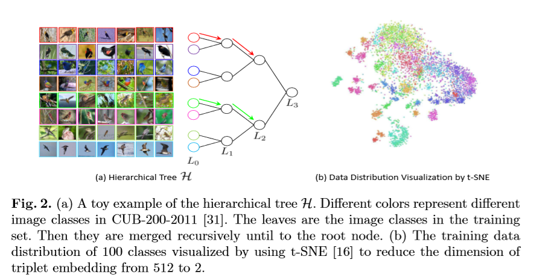
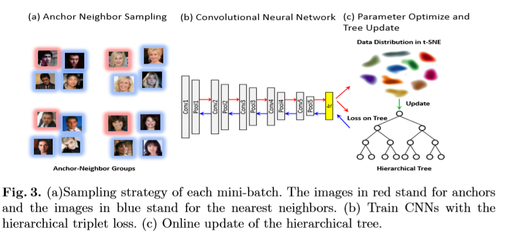
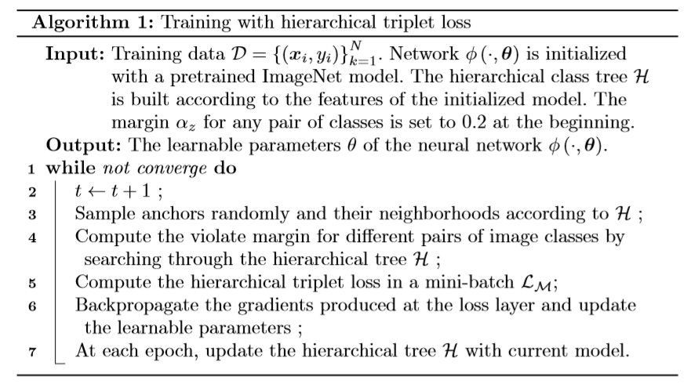

# Deep Metric Learning with Hierarchical Triplet Loss

### Accepted by ECCV 2018

## Main Idea

Introduce a **Hierarchical Triplet Loss**, which through building **Hierarchical Tree** and **dynamical violate margin** skill to get more discrimative representatiobn space and to explore relationship between different class.

$$l_{tri}({T_z}) = \frac{1}{2} [ || x_a^z - x_p^z ||^2 - ||x_a^z - x_n^z||^2 + \alpha ]$$

$$L = \frac{1}{Z} ∑_{T^z \in T} l_{tri}(T_z)$$

$$d(p,q) = \frac{1}{n_pn_q} ∑_{i \in p, j \in q} ||r_i - r_j||^2 $$

$$d_0 = \frac{1}{C} ∑_{c=1}^c (\frac{1}{n_c^2 - n_c} ∑_{i\in c,j\in c}||r_i - r_j||^2 )$$

$$d_l = \frac{l(4-d_0)}{L} + d_0$$

$$\begin{aligned}
    α_z &= β + d_{H(y_a,y_n)} - s_{y_a}\\
    s_{y_a} &= \frac{1}{n_{y_a}^2 -n_{y_a}} ∑_{i,j \in y_a} ||r_i-r_j||^2
\end{aligned}$$

## Problem

little wander when author say:
> We identify the problem that most of training samples **obey** (???) the violate margin when the model starts to converge. These samples can not contribute gradients to the learning process, and thus are less informative, but can dominate the training process, which significantly degrades the model capability, with a slow convergence. 

