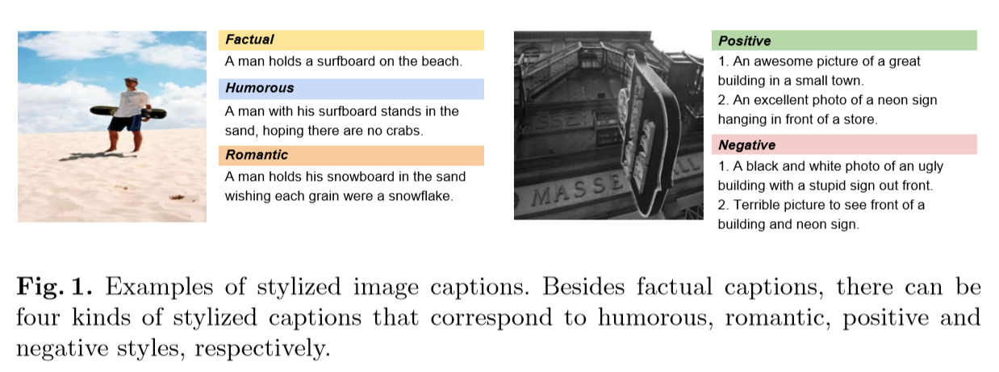
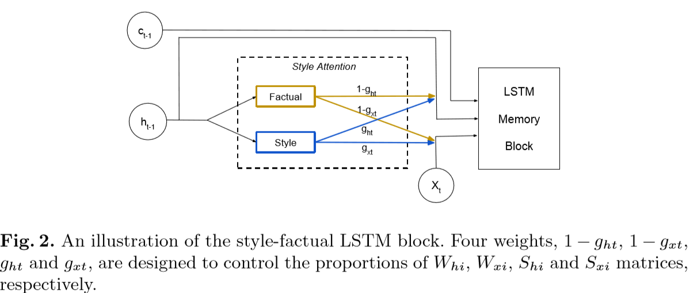
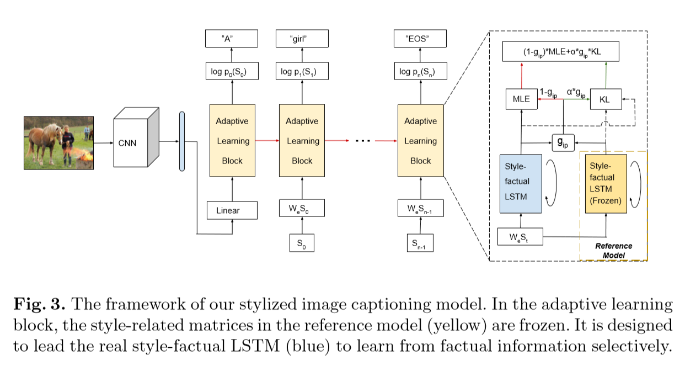

#“Factual” or “Emotional”: Stylized Image Captioning with Adaptive Learning and Attention

This paper intruduce a new LSTM, called **factual LSTM**, to deal with **multi-style**. 

And also author introduce a new model with two stage to deal with emotional or style image caption problem.

show as result:

**Factual LSTM** 

$$\begin{aligned}
    i_t &= σ( (g_{xt}S_{xi} + (1-g_{xt})W_{xi})x_t + (g_{ht}S_{hi} + (1-g_{ht})W_{hi})h_{t-1}  +b_{xi} ) \\
    f_t &= σ( (g_{xt}S_{xf} + (1-g_{xt})W_{xf})x_t + (g_{ht}S_{hf} + (1-g_{ht})W_{hf})h_{t-1}  +b_{xf} ) \\
    o_t &= σ( (g_{xt}S_{xo} + (1-g_{xt})W_{xo})x_t + (g_{ht}S_{ho} + (1-g_{ht})W_{ho})h_{t-1}  +b_{xi} ) \\
    ĉ_t &= ψ( ( g_{xt}S_{xc} + (1-g_{xt})W{xc} )x_t + (g_{ht}S_{hc} + (1-g{ht})W_{hc} )h_{t-1} ) \\
    c_t &= f_t ⊙ c_{t-1} + i_t ⊙ ĉ_t \\
    h_t &=  o_t ⊙ ψ(c_t) \\
\end{aligned}$$

## Model Stage

### Stage 1
> **fix $g_{xt}$ and $g_{ht}$ to zero, freeze style-related metric, train with paired data**

### Stage 2
> **$g_{xt}$ and $g_{ht}$ are learned by the two attention sub-networks as this activates $S_{h·}$ and $S_{x·}$.**

> For the test stage, to generate a stylized caption based on an image, we still compute $g_{xt}$ and $g_{ht}$ by the attention sub-networks, which activates $S_{h·}$ and $S_{x·}$. The classical beam search approach is used to predict the caption.
