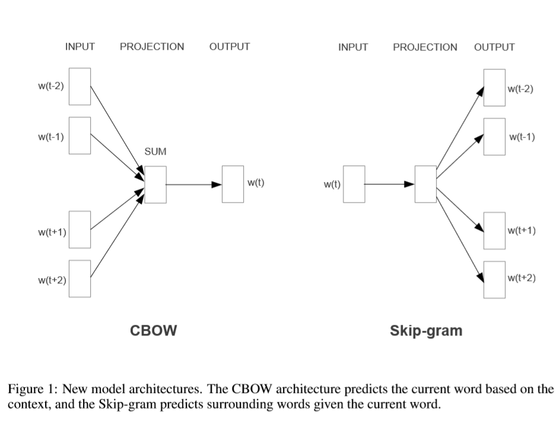

# Efficient Estimation of Word Representations in Vector Space

##1 Introduction

###1.1 goal
> Give a model to computer words **similarity** task, transfrom word's one-hot representation to a **Embedding sapace**

###1.2 previous work

> neural network language model (NNLM) a feedforward neural network with a linear projection layer and a non-linear hidden layer was used to learn jointly the word vector representation and a statistical language model
> Another architecture  of NNLM was presented in, where the word vectors are first learned using neural network with a singl ehidden layer. The word vectors are then used to train the NNLM. Thus, the word vectors are learned even without constructing the full NNLM.

##2 Model Architectures

>Latent Semantic Analysis (LSA) and Latent Dirichlet Allocation (LDA) also estimating continuous representation of words

> Training complexity is proportinal to:

$$O = E ×T ×Q$$

where E is training epoch, T is number of word in training set, Q is defined futher for each model architecture

###2.1 FeedforwardNeuralNetLanguageModel(NNLM)

> Consist by four layer: input, projection, hidden and output

$$computational\ complexity \ Q = N ×D + N ×D×H + H ×V$$

>use **hierarchical softmax** where the vocabulary is represented as a **Huffmanbinary tree**

###2.2 Recurrent Neural Net Language Model(RNNLM)
>use RNN to overcome certain limitations of the feedforward NNLM, RNN can effeciently represent more complex pattern than shallow neural network

$$Q = H ×H + H ×V$$

##3 New Log-linear Models

>two new model architectures  for learning distributed representations try to **minimize computational complexity**:
>previous model use non-linear hidden layer which make model **attractive** 
>that neural network language model can be successfully trained in twos teps: 
>- first,continuous word vectors are learned using simplemodel
>- then the N-gram NNLM is trained on top of these distributed representations of words. 

###3.1 ContinuousBag-of-WordsModel 

$$Q = N ×D + D×log_2(V)$$

###3.2 Continuous Skip-gram Model

>instead of CBOW try predicting the current word based on the context, Skip-gram minimize classification of a word based on another word in same sentence.

>Increasing the range improves quality of the resulting word vectors

$$Q = C ×(D + D×log_2(V))$$
> C is maximum distance of words

