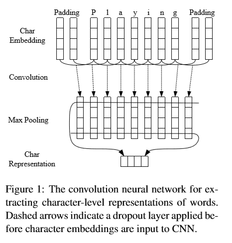
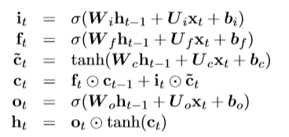
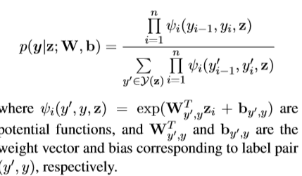
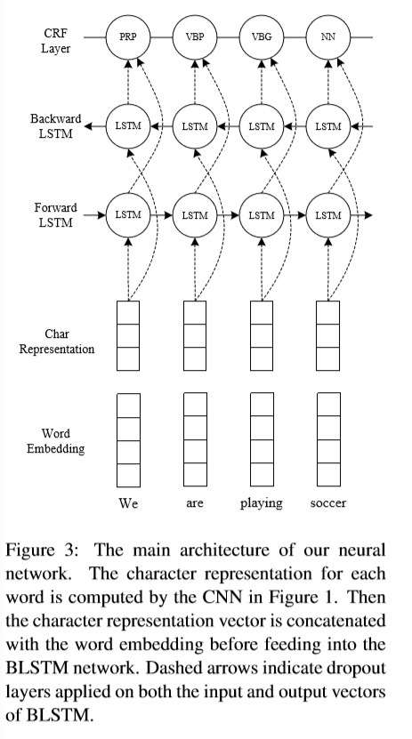

# Efficient Estimation of Word Representations in Vector Space

##1 Introduction

This paper try to create a system which is **end-to-end**, requireing no feature engineering or data pre-processing on **seqence labeling** problem

>two kind of linguistic seqence labeling:
- part of speech(POS)
- entity recognition(NER)

>Traditional high performance seqence labeling model are linear model, inclouding HMM, CRF which heavy dependent on hand-crafted features and task-specific resources. However this is costly.

##2 Neural Network Architecture

##2.1 CNN for Character-level Representation

##2.2 Bi-directional LSTM

###2.2.1 LSTM Unit

$$\begin{aligned}
    i_t &= σ(W_i h_{t-1} + U_i x_t + b_i) \\
    f_t &= σ(W_f h_t-1 + U_f x_t + b_f) \\
    ̃c &= tanh(W_c h_{t-1} + U_c x_t +b_c) \\
    c_t &= f_t ⊙ c_{t-1} + i-t ⊙ ̃c \\
    o_t &= σ(W_o h_{t-1} + U_o x_t + b_o) \\
    h_t &= o_t ⊙ tanh(c_t) \\
\end{aligned}$$

###2.2.2 BLSTM

###2.3 CRF

$$\begin{aligned}
    p(y|z;W,b) = \frac{∏_{i=1}^n ψ_i(y_{i-1}, y_i, z) }{∑_{y' ∈ Y(z)} ∏_{i=1}&n ψ_i (y'_{i-1}, y'_i, z) }
\end{aligned}$$

###2.4 BLSTM-CNNs-CRF

For each word, the character-level representation is computed by the CNN with character embedding as inputs. Then character-level represention vector is concatenated with the word embedding vector to feed to BLSTM. Then output vector of BLSTM feed to CRF

