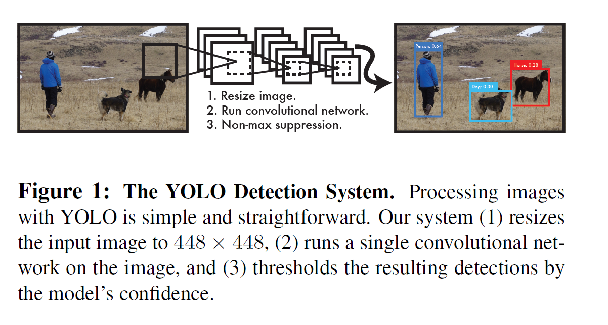
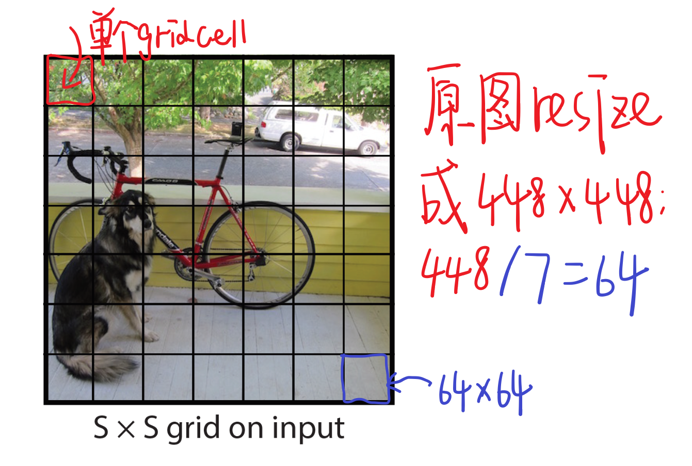
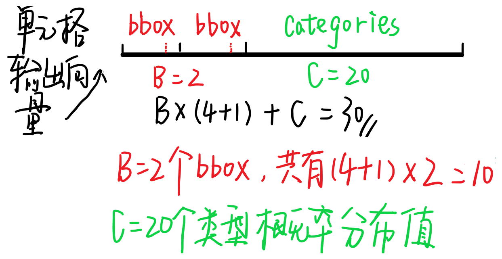
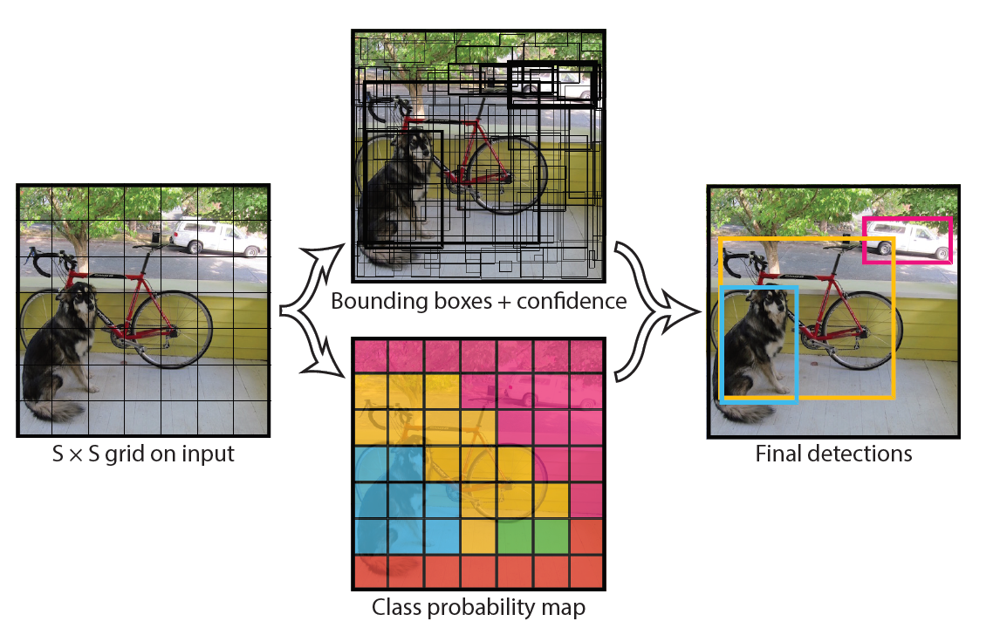
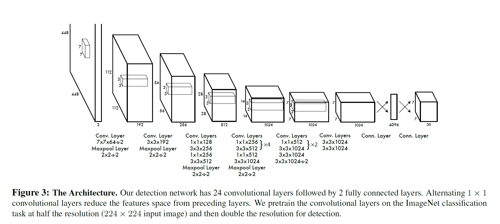
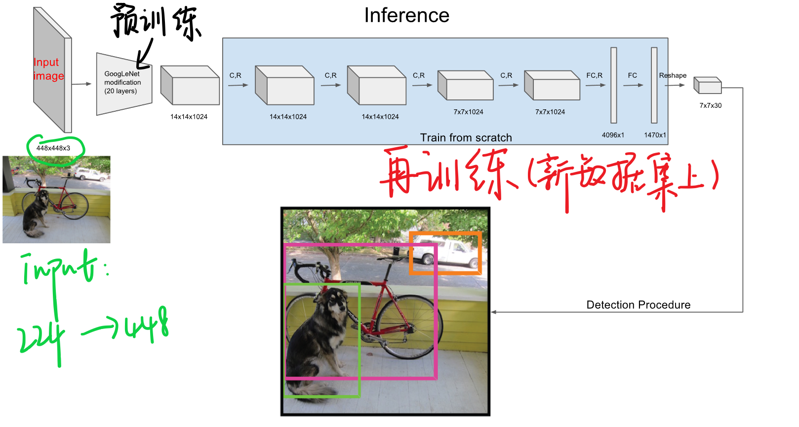
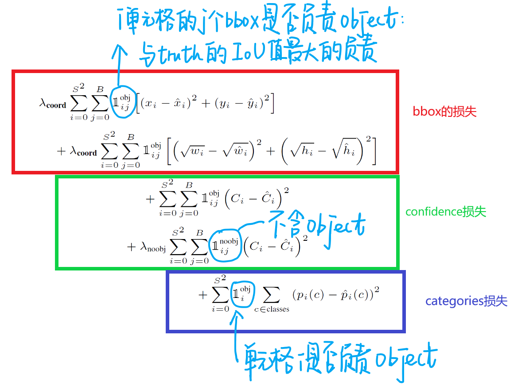
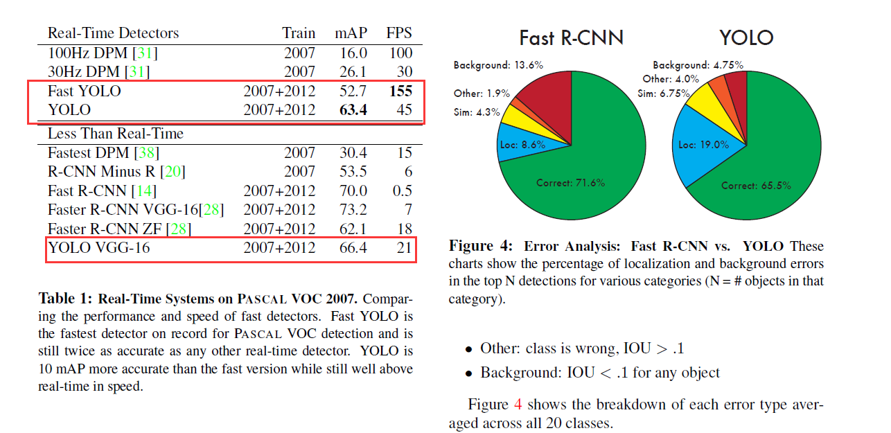

<!-- TOC -->

- [1. Yolo](#1-yolo)
    - [1.1. Papers](#11-papers)
    - [1.2. Introduction](#12-introduction)
    - [1.3. WorkFlow](#13-workflow)
        - [1.3.1. 切分单元格](#131-%E5%88%87%E5%88%86%E5%8D%95%E5%85%83%E6%A0%BC)
        - [1.3.2. 记号说明](#132-%E8%AE%B0%E5%8F%B7%E8%AF%B4%E6%98%8E)
        - [1.3.3. 单元格输出](#133-%E5%8D%95%E5%85%83%E6%A0%BC%E8%BE%93%E5%87%BA)
        - [1.3.4. 检测流程](#134-%E6%A3%80%E6%B5%8B%E6%B5%81%E7%A8%8B)
    - [1.4. Net](#14-net)
    - [1.5. Transfer Learning(Pre Training)](#15-transfer-learningpre-training)
    - [1.6. Training](#16-training)
        - [1.6.1. loss function](#161-loss-function)
        - [1.6.2. Detail](#162-detail)
    - [1.7. 缺点](#17-%E7%BC%BA%E7%82%B9)
- [2. Yolo V2](#2-yolo-v2)
    - [2.1. Better](#21-better)
        - [2.1.1. Batch Normalization](#211-batch-normalization)
        - [2.1.2. High Resolution Classifier](#212-high-resolution-classifier)
- [3. Refence](#3-refence)

<!-- /TOC -->

# 1. Yolo

## 1.1. Papers
[You Only Look Once: Unified, Real-Time Object Detection](https://arxiv.org/abs/1506.02640)
[YOLO9000: Better, Faster, Stronger](https://arxiv.org/abs/1612.08242)

## 1.2. Introduction
论文主要对比R-CNN系列，指出了R-CNN系列速度慢的原因是：模型把物体检测任务分为了多个阶段，而这几个阶段需要分开训练，难以优化(虽然Faster R-CNN是一个整体的网络，但是训练的时候还是需要交替训练)。

> 为什么非要分为多个阶段？ 

> 这是因为基于`RPN(region proposal networks)`在设计时已经把object detection问题分为多个`pipeline`，如果要改，就要把`RPN`方案砍掉。

YOLO在此基础上重建了整个模型框架，将原先的**Region Proposal**一套方案抛弃掉，将`object detection`作为回归问题来处理，模型能够接收原始像素直接输出`object`的`bbox`和类别`categories`，也就是`end-to-end`模型.

## 1.3. WorkFlow

大致步骤为：
- 整个图片`resize`到指定大小，得到图片`InputrsInputrs`
- 将`InputrsInputrs`塞给`CNN`
- 使用`NMS`(非极大值抑制)去除多余框，得到最后预测结果
### 1.3.1. 切分单元格

首先会把原始图片resize到448×448448×448,放缩到这个尺寸是为了后面整除来的方便。再把整个图片分成S×S(例:7×7)个单元格，此后以每个单元格为单位进行预测分析。

每个单元格需要做三件事:
- 如果一个object的中心落在某个单元格上，那么这个单元格负责预测这个物体(论文的思想是让每个单元格单独干活)
- 每个单元格需要预测B个`bbox`值(`bbox`值包括坐标和宽高)，同时为每个`bbox`值预测一个置信度(`confidence scores`)。也就是每个单元格需要预测`B×(4+1)`个值
- 每个单元格需要预测C(物体种类个数)个条件概率值
- 注意到： 每个单元格只能预测一种物体，并且直接预测物体的概率值。但是每个单元格可以预测多个bbox值(包括置信度)

### 1.3.2. 记号说明
- 我们预测的(x,y)、(w,h)是经过归一化处理的，表示的时中心相对于单元格的offset

>$${x=\frac{x_cS}{w_i}-x_{col}}$$ 
$${y=\frac{y_cS}{h_i}-y_{row}}$$ 
$${w=\frac{w_b}{w_i}}$$ 
$${h=\frac{h_b}{h_i}}$$

- Confidence 
这个置信度有两个含义：一是格子内是否有目标，二是bbox的准确度 
${P(Object)*IOU^{truth}_{pred}}$

- C个种类的概率值 
${P(Class_i)=P(Class_i|Object)}$ 
需要注意的是：输出的种类概率值是针对网格的，不是针对bbox的。所以一个网格只会输出CC个种类信息。(这样就是默认为一个格子内只能预测一种类别的object了，简化了计算，但对于检测小object很不利)。
在检测目标时，我们把confidence做处理： 
$$\begin{aligned}
    Confidence&=P(Object)P(Class_i|Object)*IOU^{truth}_{pred}\\
    &=P(Class_i)*IOU^{truth}_{pred}
    \end{aligned}$$

### 1.3.3. 单元格输出

每个网络一共会输出:B×(4+1)+CB×(4+1)+C个预测值.故所有的单元格输出为:S×S×(B×5+C)个预测值.

YOLO论文中：S=7,B=2,C=20所有单元格输出为7×7×(2×5+20)，即最终的输出为7×7×307×7×30的张量。

### 1.3.4. 检测流程

- 分割成单元格
- 预测bbox与类别信息，得到最终的specific confidence
- 设置阈值，滤掉低分的bbox
- 非极大值抑制得到最终的bbox

## 1.4. Net

## 1.5. Transfer Learning(Pre Training)

## 1.6. Training 

### 1.6.1. loss function

$${
    \lambda_{coord}\sum_{i=0}^{S^2}\sum_{j=0}^{B} \mathbb{1}_{ij}^{obj}[(x_i-\bar x_i)^2+(y_i-\bar y_i)^2]
    + \lambda_{coord} \sum_{i=0}^{S^2}\sum_{j=0}^{B}
    + \sum_{i=0}^{S^2}\sum_{j=0}^{B} \mathbb{1}(C_i-\bar C_i)^2
    + \lambda_(noobj)(C_i-\bar C_i)^2
    + \sum_{i=0}^{S^2}\sum_{c\in classes}{p_i(c)-\bar p_i(c)} 
}$$

每个图片的每个单元格不一定都包含object，如果没有object，那么confidence就会变成0，这样在优化模型的时候可能会让梯度跨越太大，模型不稳定跑飞了。为了平衡这一点，在损失函数中，设置两个参数λcorrd和λnoobj，其中λcorrd控制bbox预测位置的损失，λnoobj控制单个格内没有目标的损失。

### 1.6.2. Detail

- 在激活函数上:
最后一层使用的是标准的线性激活函数，其他的层都使用leaky rectified linear activation
- 在学习率上:
前75个epoch设置为10−210−2
再30个epoch设置为10−310−3
最后30个epoch设置为10−410−4
- 其他的训练细节:
batch=64
动量0.9，衰减为0.0005
使用dropout，设置为0.5，接在第一个FC层后
对样本做了数据增强

## 1.7. 缺点

论文给出了YOLO与Fast RCNN的对比图，YOLO的定位准确率相对于fast rcnn比较差。但是YOLO对背景的误判率比Fast RCNN的误判率低很多。这说明了YOLO中把物体检测的思路转成回归问题的思路有较好的准确率，但是bounding box的定位不是很好

YOLO有如下特点：

- 速度快。YOLO将物体检测作为回归问题进行求解，使用单个网络完成整个检测过程。
- 召回率低，表现为背景误检率低。YOLO可以get到图像的整体信息，相比于region proposal等方法，有着更广阔的“视野”。
- 泛化能力强，对其他类的东西，训练后效果好。

# 2. Yolo V2

## 2.1. Better

### 2.1.1. Batch Normalization
使用BN的好处对数据分布做了修正，这样网络可以更快更好的学习。在网络的每个卷积层后增加Batch Norm，同时弃用了dropout，网络的上升了2%mAP.

### 2.1.2. High Resolution Classifier

原本的所有的state-of-the-art检测模型都是使用ImageNet预训练的模型，比方说AlexNet训练时输入小于256×256，原本的YOLO是在224×224上预训练，在后面训练时候提升到448×448,这样模型需要去适应新的分辨率。YOLO2是直接使用448×448的输入，在ImageNet上跑了10个epochs.让模型时间去适应更高分辨率的输入。这使得模型提高了4%的mAP.

# 3. Refence
[DelphiFan's Blog](http://hellodfan.com/2017/10/11/%E7%89%A9%E4%BD%93%E6%A3%80%E6%B5%8B%E8%AE%BA%E6%96%87-YOLO%E7%B3%BB%E5%88%97/)
这是个做的不错的博客，作者写了很多视觉论文的Note