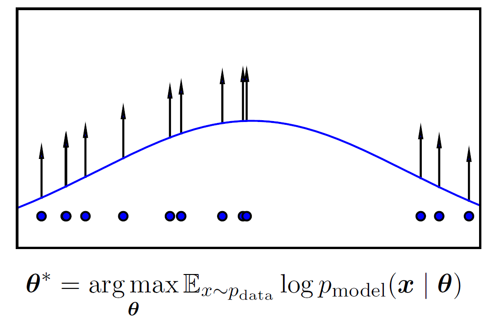
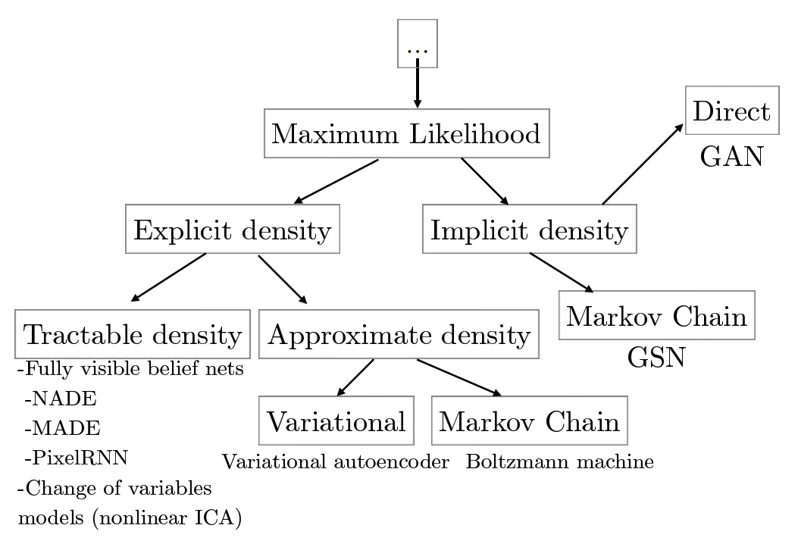
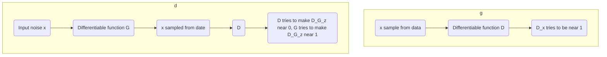
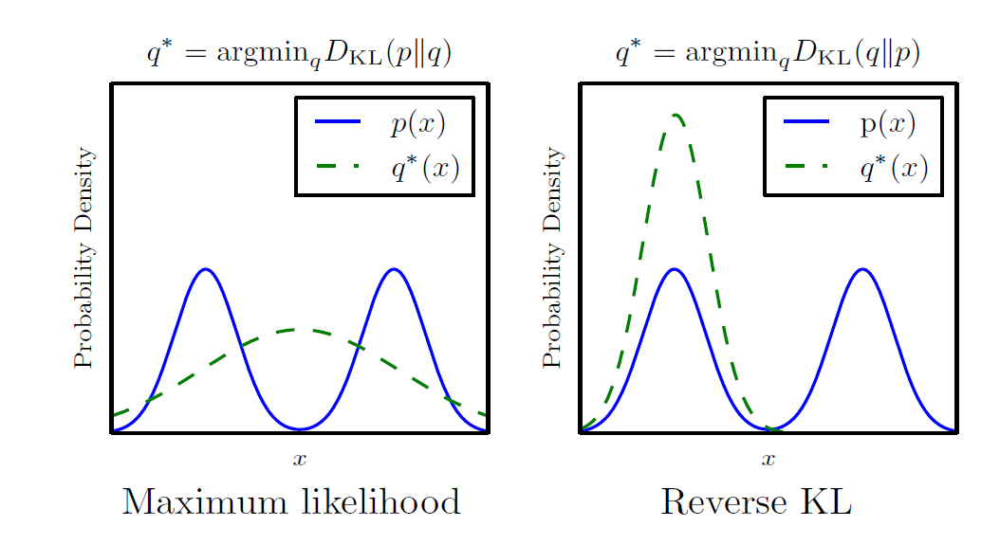
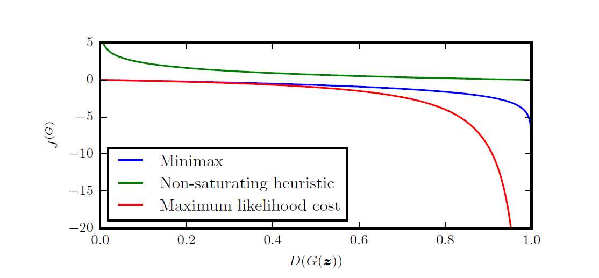
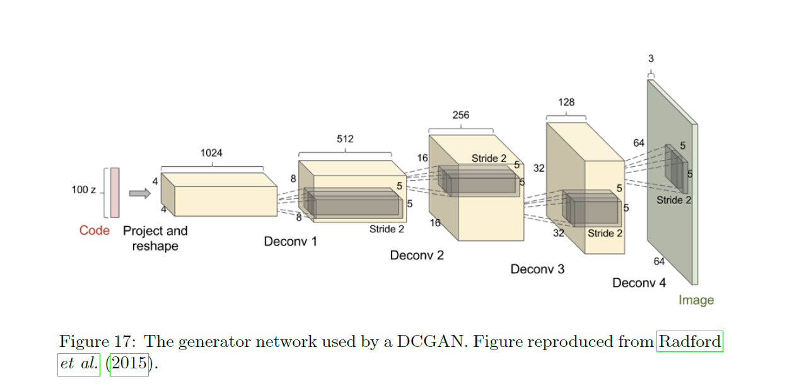
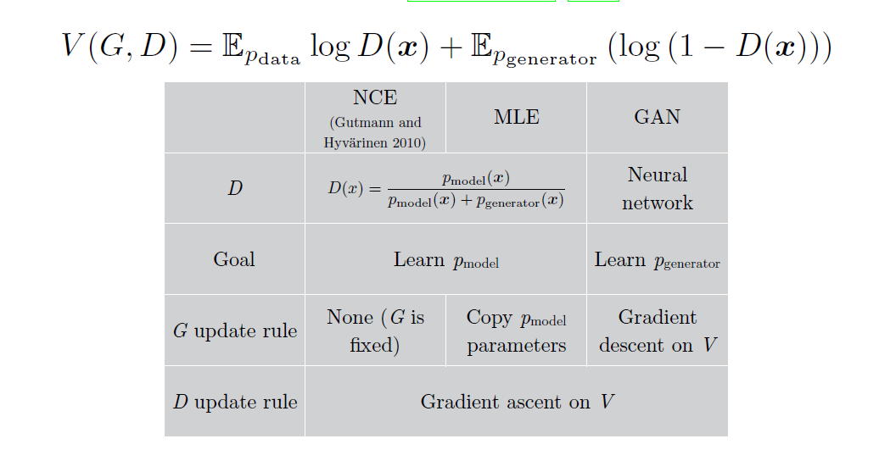
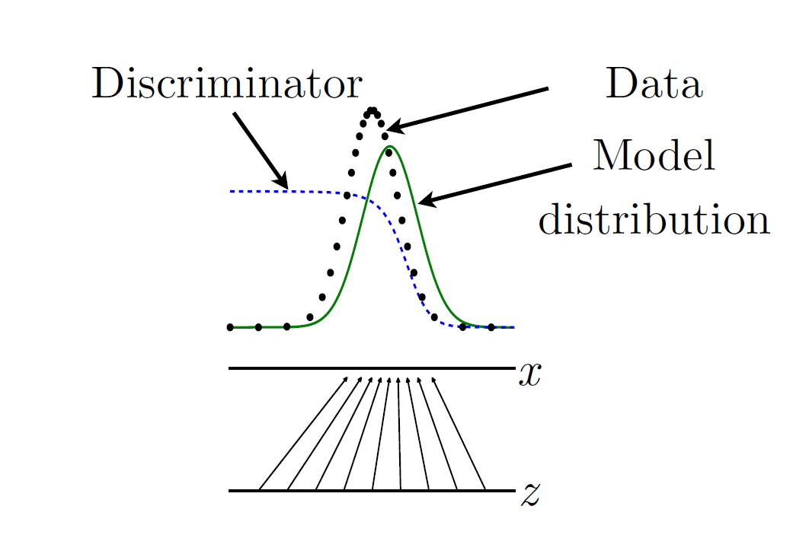

# Note on NIPS 2016 Tutorial:Generative Adversarial Networks

Refrence Link : [NIPS 2016 Tutorial:Generative Adversarial Networks]https://arxiv.org/abs/1701.00160)

# Introduction

> Generative adversarial networks are an example of `generative models`.

## Main Section

- Why generative modeling is a topic worth studying,
- how generative models work, and how GANs compare to other generativemodels
- the details of how GANs work
- research frontiers in GANs
- state-of-the-art image models that combine GANs with other methods.
-  Finally, the tutorial contains three exercises for readers to complete, and the solutions to these exercises.

## Two Part

- *generator*
- *discriminator*

# 1. Why study generative modeling?

- Training and sampling from generative models is an excellent test of our ability to represent and manipulate high-dimensional probability distributions

- Generative models can be incorporated into reinforcement learning in several ways

- Generative models can be trained with missing data and can provide predictions on inputs that are missing data

- enable machine learning to work with multi-modal outputs

- Finally, many tasks intrinsically require realitic generation of samples from some distribution

## Exemple of tasks that intrinsically require the generation of good samples

- Single image super-resolution 

- create art

- Image-to-image translation applications

# 2. How do generative models work? How do GANs compare to others?

## 2.1 Maximum likelihood estimation

$${Likellihood = \prod_{i=1}^{m}P_{model}(x^{(i)};\theta)}$$

>where m is dataset-size

$$\begin{aligned}{}
\theta^\star &= \arg\max_\theta \prod_{i=1}^m{p_{model}(x^{(i)};\theta)} \\
&= \arg\max_\theta \log \prod_{i=1}^m{p_{model}(x^{(i)};\theta)} \\
&= \arg\max_\theta \sum_{i=1}^m {\log {p_{model}(x^{(i)};\theta)}} 
\end{aligned}
$$

> The maximum likelihood process consists of taking several samples from the data generating distribution to form a training set, then pushing up on the probability the model assigns to those points, in order to maximize the likelihood of the training data. This illustration shows how different data points push up on different parts of the density function for a Gaussian model applied to 1-D data. The fact that the density function must sum to 1 means that we cannot simply assign innite likelihood to all points; as one point pushes up in one place it inevitably pulls down in other places. The resulting density function balances out the upward forces from all the data points in different locations 

## 2.2 A taxonomy of deep generative models

>**we can compare several models by contrasting the ways that they compute either the likelihood and its gradients, or approximations to these quantities.**

## 2.3 Explicit density models

- explicit density function $p_{model}(x;\theta)$

- main difficulty

>designing a modelthat can capture all of the complexity of the data to be generated while stillmaintaining computational tractability

- two different strategies

- - (1) *careful construction of models whose structure guarantees their tractability*

- - (2) *models thatadmit tractable approximations to the likelihood and its gradients*

### 2.3.1 Tractable explicit models

*two popular approaches*

- **Fully visible belief networks**

> FVBNs are models that use the **chain rule of probability** to decompose a probability distribution over an n-dimensional vector x into a product of one-dimensional probability distributions

$${p_{model}(x) = \prod_{i=1}^n {p_{model}(x_i|x_1,x_2,...,x_{i-1})}}$$

>cost of generating a sample is O(n).

- **Nonlinear independent components analysis**

$$
{p_x(x) = p_z (g^{-1}(x))}
\begin{vmatrix}
det \left( \frac{\partial g^{-1}(x) }{\partial x} \right)
\end{vmatrix}
$$

### 2.3.2 Explicit models requiring approximation

*two categories*

- those using deterministic approximations, which almost always means variational methods

- those using stochastic approximations, meaning Markov chain Monte Carlo methods

**Variational approximations**

> **define lower bound**
$${\mathcal L(x;\theta) \le \log P_{model}(x;\theta)}$$
>
> **drawback**
>
>when too weak of an approximate posterior distribution or too weak of a prior distribution is used, even with a perfect optimization algorithm and innite training data, the gap between L and the true likelihood can result in p_model learning something other than the true p_data

**Markov chain approximations**

>Markov chains often fail to scale to high dimensional spaces, and impose increased computational costs for using the generative model
>
> sampling-based model works resonalbaly well as long as fair sample can be generated **quickly** and variance across samples is **not too high**.
>
> this convergence can be very slow, and there is sno clear way to test whether the chain has converged
>
>high-dimensional spaces, Markov chains become less effcient.
>
>
## 2.4 Implicit density models

- **generative stochastic network**
>
>Some of these implicit models based on drawing samples from pmodel define a Markov chain transition operator that must be run several times to obtain a sample from the model. From this family, the primary example is the
>
>
>
## 2.5 Comparing GANs to other generative models

>GANs were designed to avoid many disadvantages associated with other generative models

- They can generate samples in parallel, instead of using runtime proportional to the dimensionality of x. This is an advantage relative to FVBNs

- The design of the generator function has very few restrictions. This is an advantage relative to Boltzmann machines, for which few probability distributions admit tractable Markov chain sampling, and relative to nonlinear ICA, for which the generator must be invertible and the latent code z must have the same dimension as the samples x.

- No Markov chains are needed. This is an advantage relative to Boltzmann machines and GSNs.

- No variational bound is needed, and specic model families usable within the GAN framework are already known to be universal approximators, so GANs are already known to be asymptotically consistent. Some VAEs are conjectured to be asymptotically consistent, but this is not yet proven.

- GANs are subjectively regarded as producing better samples than other methods.

> GANs have taken on a new **disadvantage**: training them requires finding the Nash equilibrium of a game, which is a more diffcult problem than optimizing an objective function.

# 3. How do GANs work?

## 3.1 The GAN framework

>The basic idea of GANs is to set up a game between two players.
> GANs are a structured probabilistic model

>The discriminator learns using traditional supervised learning techniques, dividing inputs into two classes (real or fake). 
>
>The generator is trained to fool the discriminator.
>
**generator**

>funtion $D$,take $x$,use $\bm \theta^D$,minimize $J^G=(\bm \theta^D,\bm \theta^G)$

**discriminator**

>function $G$,take $z$, use $\bm \theta^G $,minimize $J^D=(\bm \theta^D,\bm \theta^G)$

>The relationship with variational autoencoders is more complicated; the GAN framework can train some models that the VAE framework cannot and vice versa, but the two frameworks also have a large intersection. The most salient difference is that, **if relying on standard backprop, VAEs cannot have discrete variables at the input to the generator, while GANs cannot have discrete variables at the output of the generator.**

**The training process**

>Use `SGD`, two minibatch `x`, `z`. 
Generator:  update $\bm \theta^G$,reduce $J^G$
Discrimator: update $\bm \theta^D$,reduce $J^D$

>Many authors recommend running moresteps of one player than the other, but as of late 2016, the author's opinion is thatthe protocol that works the best in practice is simultaneous gradient descent,with one step for each player.

## 3.2 Cost functions

### 3.2.1 The discriminator's cost,$J^D$

$$J^D(\bm \theta^D,\bm \theta^G) = - \frac{1}{2} \mathbb E_{x \sim {P_{data}} }\log D(x) - \frac{1}{2} \mathbb E_{z} \log(1-D(G(z)))  $$

> Use standard cross-entropy cost , classifer is trained on two minibatches, one from dataset labeled with 1, and one from generator labeled with 0.

> $$ \frac{p_{data}(\bm x)}{p_{model}(\bm x)} $$

### 3.2.2 Minimax

>simplest version of the game is a **zero-sum game**

$$\begin{aligned}
J^G&=-J^D\\
V(\bm \theta^D,\bm \theta^G)&=-J^D(\bm \theta^D,\bm \theta^G)\\
\bm \theta^{G*} &= \arg \min_{\bm \theta^G} \max_{\bm \theta^D} V(\bm \theta^D,\bm \theta^G)
\end{aligned}
$$

### 3.2.3 Heuristic, non-saturating game

> In the minimax game, the discriminator minimizes a cross-entropy, but the generator maximizes the same cross-entropy. This is unfortunate for the generator, because when the discriminator successfully rejects generator samples with high condence, the generator's gradient vanishes.

To fix this prblem, we ip the target used to construct thecross-entropy cost. The cost for the generator then becomes:
$$J^G = -\frac{1}{2} \mathbb E_z \log D(G(z))$$

### 3.2.4 Maximum likelihood game

>minimizing the KL divergence between the data and the model

$$J^G = -\frac12 \mathbb E_z \exp(\sigma^{-1}(D(G(z))))$$

### 3.2.5 Is the choice of divergence a distinguishing feature of GANs?

>many people (including the author) believed that **GANs** produced sharp, realistic samples because they minimize the **Jensen-Shannon divergence** while **VAEs** produce **blurry samples** because they minimize the **KL divergence** between the data and the model.

**The KL divergence is not symmetric** minimizing $D_{KL}(p_{data}||p_{model})$ is different with $D_{KL}(p_{model}||p_{data})$
>Maximum likelihood estimation performs the former; minimizing the Jensen-Shannon divergence is somewhat more similar to the latter.

> Still have some evidence show that the use of Jesen-Sahnnon divergence does not explain why GANs make shaper samples:

-  It is now possible to train GANs using maximum likelihood. These models still generate sharp samples, and still select a small number of modes.

- GANs often choose to generate from very few modes; fewer than the limitation imposed by the model capacity. The reverse KL prefers to generate from as many modes of the data distribution as the model is able to; it does not prefer fewer modes in general. This suggests that the mode collapse is driven by a factor other than the choice of divergence.

### 3.2.6 Comparsion of cost function

> GANs could be seen as learning by a strange kind of reinforcement learning. There ware some difference:

- The generator is able to observe not just the output of the reward function but also its gradients

- The reward function is non-stationary; the reward is based on the discriminator which learns in response to changes in the generator's policy.

> The cost that the generator receives for generating a samples G(z) depends only on how the discriminator responds to that sample. The more probability the discriminator assigns to the sample being real, the less cost the generator receives. We see that when the sample is likely to be fake, both the minimax game and the maximum likelihood game have **very little gradient**, on the at left end of the curve. The heuristically motivated non-saturating cost avoids this problem. Maximum like-lihood also suffers from the problem that nearly all of the gradient comes from the right end of the curve, meaning that a very small number of samples dominate the gradient computation for each minibatch. This suggests that variance reduction tech-niques could be an important research area for improving the performance of GANs, especially GANs based on maximum likelihood.

## 3.3 The DCGAN architecture

- Use batch normalization layers in most layers of both the discriminator and the generator, with the two minibatches for the discriminator normalized separately. The last layer of the generator and rst layer of the discriminator are not batch normalized, so that the model can learn the correct mean and scale of the data distribution

- The overall network structure is mostly borrowed from the all-convolutional net

- The use of the Adam optimizer rather than SGD with momentum

## 3.4 How do GANs relate to noise-contrastive estimation and maximum likelihood?

**Connect to noise-constrastive estimation**

>the goal of NCE is to learn the density model within the discriminator, while the goal of GANs is to learn the sampler dening the generator.

# 4 Tips and Tricks

## 4.1 Train with labels

> Use label on shape or form could great improve quality of sample. But is not clear why it works.

## 4.2 One-sided label smoothing

>This prevents extreme extrapolation behavior in the discriminator; if it learns to predict extremely large logits corresponding to a probability approaching 1 for some input, it will be penalized and encouraged to bring the logits back down to a smaller value.

$$ D^*(x) = \frac{(1-\alpha)p_{data}(x) + \beta P_{model}(x) }{ p_{data}(x) + p_{model}(x) } $$

> If $\beta$ is zero, then smoothing by $\alpha$ does nothing but scale down the optimal value of the discriminator.When $\beta$ is nonzero, the shape of the optimal discriminator function changes. In particular, in a region where pdata(x) is very small and pmodel(x) is larger, D*(x) will have a peak near the spurious mode of pmodel(x). The discriminator will thus reinforce incorrect behavior in the generator; the generator will be trained either to produce samples that resemble the data or to produce samples that resemble the samples it already makes.

> One reason that label smoothing works so well as a regularizer is that it does not ever encourage the model to choose an incorrect class on the training set, but only to reduce the condence in the correct class. Other regularizers such as weight decay often encourage some misclassication if the coeffcient on the regularizer is set high enough. Warde-Farley and Goodfellow (2016) showed that label smoothing can help to reduce vulnerability to adversarial examples, which suggests that label smoothing should help the discriminator more effciently learn to resist attack by the generator.

## 4.3 Virtual batch normalization

**good side**

>The main purpose of batch normalization is to improve the optimization of the model
>
>It is important that the normalization operation is part of the model, so that back-propgation computes the gradient of features that are dened to always be normalized.
>

**unfortunate side**

>When minibatch sizes are small these  fluctuations can become large enough that they have more effect on the image generated by the GAN than the input z has.

**Ref-erence batch normalization**

>

## 4.4 Can one balance G and D?

>This ratio is estimated correctly only whenthe discriminator is optimal, so it is ne for the discriminator to overpower the generator.
>
>- Sometimes the gradient for the generator can **vanish** when the discriminator becomes too accurate. The right way to solve this problem is not to limit the power of the discriminator, but to use a **parameterization** of the game where the gradient does not vanish
>
>- Sometimes the gradient for the generator can become very large if the discriminator becomes too condent. Rather than making the discriminator less accurate, a better way to resolve this problem is to use one-sided label smoothing 

- One can also try to balance the generator and discriminator by choosing the model size.

# 5 Research Frontiers

## 5.1 Non-convergence

> Even if eachplayer successfully moves downhill on that player's update, the same update might move the other player uphill.

### 5.1.1 Mode collapse

generator learns to map several different input z values to the same output point.

complete mode collapse is rare, but parital mode collapse is common

> Mode collapse may arise because the maximin solution to the GAN game is different from the minimax solution.
$$ G^* = \min_G \max_D V(G,D) $$
$$ G^* = \max_D \min_G V(G,D) $$

>mode collapse does not seem to be caused by any particular cost function

It is commonly asserted that mode collapseis caused by the use of Jensen-Shannon divergence, but this does not seem to be the case, because GANs that minimize approximations of DKL(pdatakpmodel) face the same issues, and because the generator often collapses to even fewer modes than would be preferred by the Jensen-Shannon divergence.

**minibatch features**

**unrolled GANs**

### 5.1.2 Other games

>If our theory of how to understand whether a continuous, high-dimensional nonconvex game will converge could be improved, or if we could develop algorithms that converge more reliably than simultaneous gradient descent, several application areas besides GANs would benet. Even restricted to just AI research,

- Agents that literally play games, such as AlphaGo
- Machine learning security, where models must resist adversarial examples
- Domain adaptation via domain-adversarial learning
- Adversarial mechanisms for preserving privacy 
- Adversarial mechanisms for cryptography 

## 5.2 Evaluation of generative models

GANs are somewhat harder to evaluate than other generative models because it can be dicult to estimate the likelihood for GANs describe many of the diffculties with evaluating generative models.

## 5.3 Discrete outputs

>generator must be **differentiable**. Unfortunately, this means that the generator cannot produce **discrete** data, such as one-hot word or character representations. Removing this limitation is an important research direction that could unlock the potential of GANs for NLP. There are at least three obvious ways one could attack this problem:
- Using the REINFORCE algorithm
- Using the concrete distribution or Gumbel-softmax
- Training the generate to sample continuous values that can be decoded to discrete ones

## 5.4 Semi-supervised learning

- **CatGANs, GAN apply to semi-supervised learning**

- **feature matching GANs**

## 5.5 Using the code

## 5.6 Developing connections to reinforcement learning

# 6 Plug and Play Generative Networks

# 7 Exercises & Solutions

## 7.1 The optimal discriminator strategy

$$ J^D(\theta^D, \theta^G) = -\frac12 \mathbb E_{\bm x \sim p_{data}} log D(x) -\frac12 \mathbb E_z log(1-D(G(z))) $$

>with respect to $\theta^D$. Imagine that the discriminator can be optimized in function space, so the value of $D(x)$ is specied independently for every value of $x$.What is the optimal strategy for $D$? What assumptions need to be made to obtain this result?

first, we sholud assume that $p_{mode}$ and $p_{model}$ is not zero for everywhere. because at zero point, behavior have undefined and never visiting
to minimize $J^D$, let derivatives to zero, :

$$ \frac{\delta}{\delta D(x)} J^D = 0 $$

By solving this equation, we obtain:

$$ D^* = \frac{p_{data}(x)}{p_{data}(x)+p_{model}(x)} $$

## 7.2 Gradient descent for games

>Consider a minimax game with two players that each control a single scalar value. The minimizing player controls scalar x and the maximizing player controls scalar y. The value function for this game is

$$ V(x,y) = xy $$

- Does this game have an equilibrium? If so, where is it?

This continuous function with a saddle point, ths saddle point is $x=y=0$. so this is a quilibrime of the game. We colud have found this point by solving for where the derivatives are zero.

>Not every saddle point is an equilibrium; we require that an innitesimal perturbation of one player's parameters cannot reduce that player's cost. The saddle point for this game satises that requirement. It is something of a pathological equilibrium because the value function is constant as a function of each player's parameter when holding the other player's parameter fixed.

- Consider the learning dynamics of simultaneous gradient descent. To simplify the problem, treat gradient descent as a continuous time process. With an innitesimal learning rate, gradient descent is described by a system of partial dierential equations:

$$ \frac{\partial x}{\partial t} = -\frac{\partial}{\partial y} V(x(t),Y(t)) $$

$$ \frac{\partial y}{\partial t} = -\frac{\partial}{\partial y} V(x(t),Y(t)) $$
Solve for the trajectory followed by these dynamics.

To solving this problem, we get:

$$ \frac{\partial x}{\partial t} = -y(t) $$
$$ \frac{\partial y}{\partial t} = x(t) $$

$$ \frac{\partial^2 y}{\partial t^2} = \frac{\partial x}{\partial t} = -y(t) $$

Differential equations of this form have sinusoids as their set of basis functions of solutions. Solving for the coeffcients that respect the boundary conditions, we obtain

$$ x(t) = x(0)cos(t) - y(0)sin(t) $$
$$ y(t) = x(0)sin(t) + y(0)cos(t) $$

These dynamics form a circular orbit, as shown in gure 37. In other words, simultaneous gradient descent with an innitesimal learning rate will orbit the equilibrium forever, at the same radius that it was initialized. With a larger learning rate, it is possible for simultaneous gradient descent to spiral outward forever. Simultaneous gradient descent will never approach the equilibrium.

For some games, simultaneous gradient descent does converge, and for others, such as the one in this exercise, it does not. For GANs, there is no theoretical prediction as to whether simultaneous gradient descent should converge or not. Settling this theoretical question, and developing algorithms guaranteed to converge, remain important open research problems.

## 7.3 Maximum likelihood in the GAN framework

>In this exercise, we will derive a cost that yields (approximate) maximum likelihood learning within the GAN framework. Our goal is to design $J(G)$ so that, if we assume the discriminator is optimal, the expected gradient of $J(G)$ will match the expected gradient of $D_{KL}(p_{data}||P_{model})$
The solution will take the form of:

$$J^G = E_{x \sim p_g}f(x)$$

>The exercise consists of determining the form of $f$.

first, we take derivative of KL divergence with  respect to a parameter $\theta$:

$$ \frac{\partial}{\partial \theta} D_{KL}(p_{data}||p_g) = -\mathbb E _{x\sim p_{data}} \frac{\partial}{\partial \theta} \log_{p_g}(x) $$

$$ \frac{\partial}{\partial \theta} J^G = \mathbb E_{x \sim p_g} f(x) \frac{\partial}{\partial \theta} \log_{p_g}(x) $$

