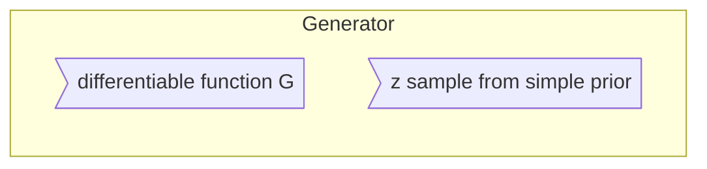

# Note on NIPS 2016 Tutorial:Generative Adversarial Networks

Refrence Link : [NIPS 2016 Tutorial:Generative Adversarial Networks]https://arxiv.org/abs/1701.00160)

# Introduction

> Generative adversarial networks are an example of `generative models`.

## Main Section

- Why generative modeling is a topic worth studying,
- how generative models work, and how GANs compare to other generativemodels
- the details of how GANs work
- research frontiers in GANs
- state-of-the-art image models that combine GANs with other methods.
-  Finally, the tutorial contains three exercises for readers to complete, and the solutions to these exercises.

## Two Part

- *generator*
- *discriminator*

# 1. Why study generative modeling?

- Training and sampling from generative models is an excellent test of our ability to represent and manipulate high-dimensional probability distributions

- Generative models can be incorporated into reinforcement learning in several ways

- Generative models can be trained with missing data and can provide predictions on inputs that are missing data

- enable machine learning to work with multi-modal outputs

- Finally, many tasks intrinsically require realitic generation of samples from some distribution

## Exemple of tasks that intrinsically require the generation of good samples

- Single image super-resolution 

- create art

- Image-to-image translation applications

# 2. How do generative models work? How do GANs compare to others?

## 2.1 Maximum likelihood estimation

$${Likellihood = \prod_{i=1}^{m}P_{model}(x^{(i)};\theta)}$$

>where m is dataset-size

$$\begin{aligned}{}
\theta^\star &= \arg\max_\theta \prod_{i=1}^m{p_{model}(x^{(i)};\theta)} \\
&= \arg\max_\theta \log \prod_{i=1}^m{p_{model}(x^{(i)};\theta)} \\
&= \arg\max_\theta \sum_{i=1}^m {\log {p_{model}(x^{(i)};\theta)}} 
\end{aligned}
$$

> The maximum likelihood process consists of taking several samples from the data generating distribution to form a training set, then pushing up on the probability the model assigns to those points, in order to maximize the likelihood of the training data. This illustration shows how dierent data points push up on dierent parts of the density function for a Gaussian model applied to 1-D data. The fact that the density function must sum to 1 means that we cannot simply assign innite likelihood to all points; as one point pushes up in one place it inevitably pulls down in other places. The resulting density function balances out the upward forces from all the data points in dierent locations 

## 2.2 A taxonomy of deep generative models

## 2.3 Explicit density models

- main difficulty

>designing a modelthat can capture all of the complexity of the data to be generated while stillmaintaining computational tractability

- two different strategies

- - (1) *careful construction of models whose structure guarantees their tractability*

- - (2) *models thatadmit tractable approximations to the likelihood and its gradients*

### 2.3.1 Tractable explicit models

*two popular approaches*

- Fully visible belief networks

$${p_{model}(x) = \prod_{i=1}^n {p_{model}(x_i|x_1,x_2,...,x_{i-1})}}$$

>cost of generating a sample is O(n).

- Nonlinear independent components analysis

$${p_x(x) = p_z (g^{-1}(x)) | det \left( \frac{\partial g^{-1}(x) }{\partial x} \right) }$$

### 2.3.2 Explicit models requiring approximation

*two categories*

- those using deterministic approximations, which almost always means variational methods

- those using stochastic approximations, meaning Markov chain Monte Carlo methods

**Variational approximations**

>lower bound
$${\mathcal L(x;\theta) \le \log P_{model}(x;\theta)}$$

**Markov chain approximations**

>Markov chains often fail to scale to high dimensional spaces, and impose increased computational costs for using the generative model

## 2.4 Implicit density models

## 2.5 Comparing GANs to other generative models

>GANs were designed to avoid many disadvantages associated with other generative models

- They can generate samples in parallel, instead of using runtime proportional to the dimensionality of x. This is an advantage relative to FVBNs

- The design of the generator function has very few restrictions. This is an advantage relative to Boltzmann machines, for which few probability distributions admit tractable Markov chain sampling, and relative to nonlinear ICA, for which the generator must be invertible and the latent code z must have the same dimension as the samples x.

- No Markov chains are needed. This is an advantage relative to Boltzmann machines and GSNs.

- No variational bound is needed, and specic model families usable within the GAN framework are already known to be universal approximators, so GANs are already known to be asymptotically consistent. Some VAEs are conjectured to be asymptotically consistent, but this is not yet proven.

- GANs are subjectively regarded as producing better samples than other methods.

> GANs have taken on a new **disadvantage**: training them requires finding the Nash equilibrium of a game, which is a more diffcult problem than optimizing an objective function.

# 3. How do GANs work?

## 3.1 The GAN framework

>The basic idea of GANs is to set up a game between two players.
> GANs are a structured probabilistic model

**generator**

funtion $D$,take $x$,use $\bm \theta^D$,minimize $J^G=(\bm \theta^D,\bm \theta^G)$

**discriminator**

function $G$,take $z$, use $\bm \theta^G $,minimize $J^D=(\bm \theta^D,\bm \theta^G)$

**The training process**

>Use `SGD`, two minibatch `x`, `z`. 
Generator:  update $\bm \theta^G$,reduce $J^G$
Discrimator: update $\bm \theta^D$,reduce $J^D$

>Many authors recommend running moresteps of one player than the other, but as of late 2016, the author's opinion is thatthe protocol that works the best in practice is simultaneous gradient descent,with one step for each player.

## 3.2 Cost functions

### 3.2.1 The discriminator's cost,$J^D$

$$J^D(\bm \theta^D,\bm \theta^G) = - \frac{1}{2} \mathbb E_{x \sim {P_{data}} }\log D(x) - \frac{1}{2} \mathbb E_{z} \log(1-D(G(z)))  $$

### 3.2.2 Minimax

>simplest version of the game is a **zero-sum game**

$$\begin{aligned}
J^G&=-J^D\\
V(\bm \theta^D,\bm \theta^G)&=-J^D(\bm \theta^D,\bm \theta^G)\\
\bm \theta^{G*} &= \arg \min_{\bm \theta^G} \max_{\bm \theta^D} V(\bm \theta^D,\bm \theta^G)
\end{aligned}
$$

### 3.2.3 Heuristic, non-saturating game

> In the minimax game, the discriminator minimizes a cross-entropy, but the generator maximizes the same cross-entropy. This is unfortunate for the generator, because when the discriminator successfully rejects generator samples with high condence, the generator's gradient vanishes.

To fix this prblem, we ip the target used to construct thecross-entropy cost. The cost for the generator then becomes:
$$J^G = -\frac{1}{2} \mathbb E_z \log D(G(z))$$

### 3.2.4 Maximum likelihood game

>minimizing the KL divergence between the data and the model

$$J^G = -\frac12 \mathbb E_z \exp(\sigma^{-1}(D(G(z))))$$

### 3.2.5 Is the choice of divergence a distinguishing feature of GANs?

>many people (including the author) believed that **GANs** produced sharp, realistic samples because they minimize the **Jensen-Shannon divergence** while **VAEs** produce **blurry samples** because they minimize the **KL divergence** between the data and the model.

**The KL divergence is not symmetric** minimizing $D_{KL}(p_{data}||p_{model})$ is different with $D_{KL}(p_{model}||p_{data})$
>Maximum likelihood estimation performs the former; minimizing the Jensen-Shannon divergence is somewhat more similar to the latter.

