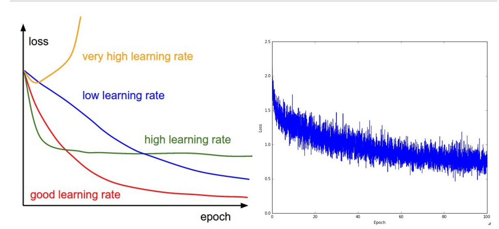

## 激活函数

- sigmoid 有饱和的风险，不能应用在较深的网络中，non-zero-centred
- tanh 相当于对sigmoid的放大，有饱和的风险，并且是zero-centred，这个函数在LSTM中还在使用
- relu 对负值抑制，正侧斜率不变，可以应用在较深的网络中，但是如果落在左侧则有神经元坏死（梯度不再更新）的风险。对learning rate敏感，relu改进为leaky relu（左侧也给予一个较小的梯度）和p relu（对不同的channal给予不同的斜率）但是不能期望它们有太好的结果，实际使用和relu性能差不多
- maxout  一种新提出的激活函数 ${max(a_1*x,a_2*x)}$
- softmax  常用于多分类问题，注意它和logistic不同，softmax预测的类之间应该是不重叠、不存在一类包含另一类的，而logistic则没有这个问题，它对多类预测是独立的。

## fine tuning

- learning rate 

- deepth

- kernel size 
不宜过大，那样会增加计算量，两个3*3的卷积视野相当于一个5\*5的卷积视野，但后者参数更多。
- filter/pooling layer 
- batch norm 
${x_i=\frac{x_i-\bar{x}}{\sqrt{\sigma^2+\epsilon}}}$
- dropout 
依先验概率不使用节点，降低Variance，增加训练时间

## 评价指标

- Persion/Recall 
${P=\frac{TP}{TP+FP}}$  
${R=\frac{TP}{TP+FN}}$
- F-score  
${F1=\frac{2PR}{P+R}}$
- ROC/AUC 
- mAP 
一般用在视觉/图像方面

